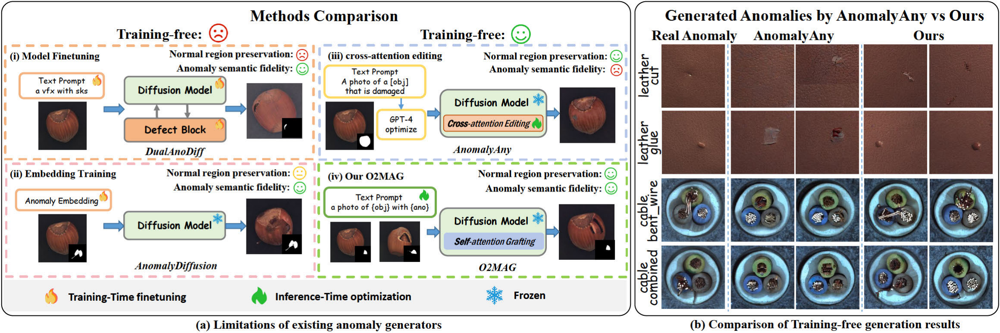
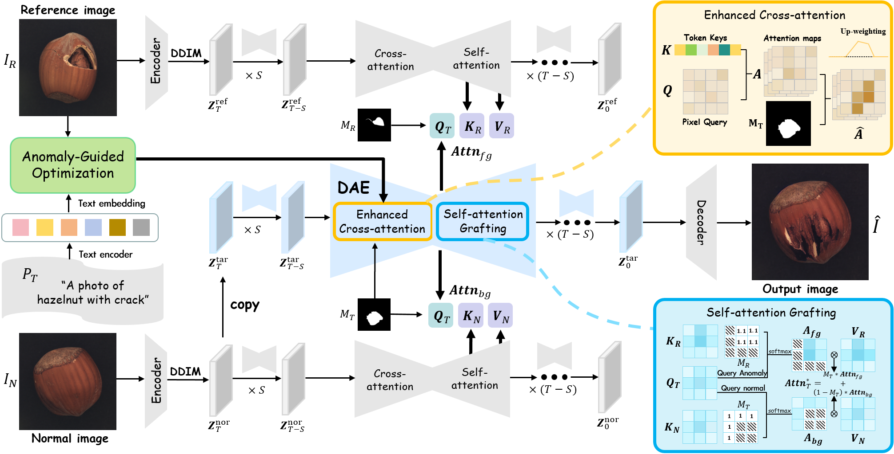
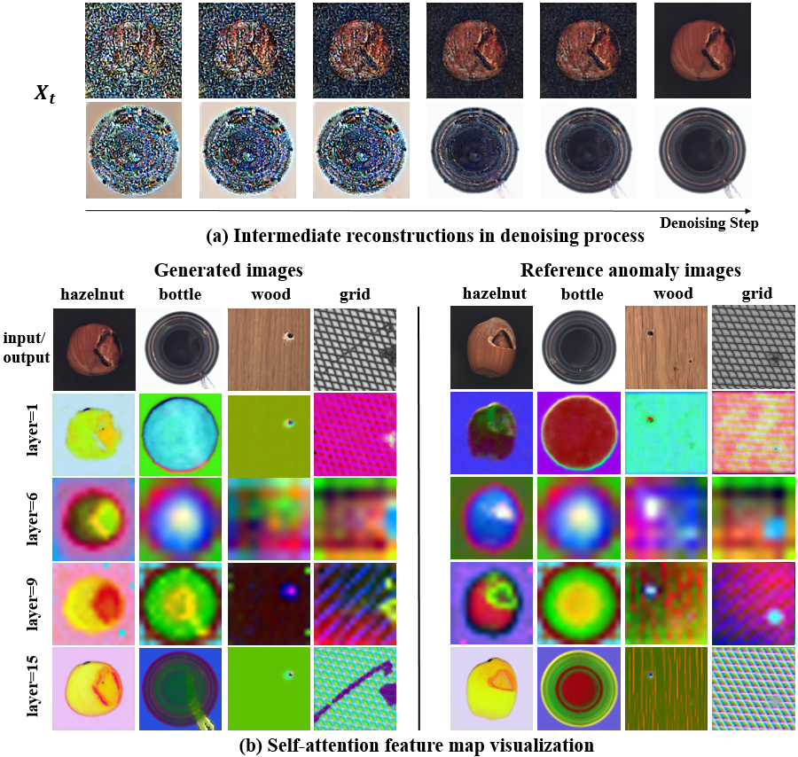
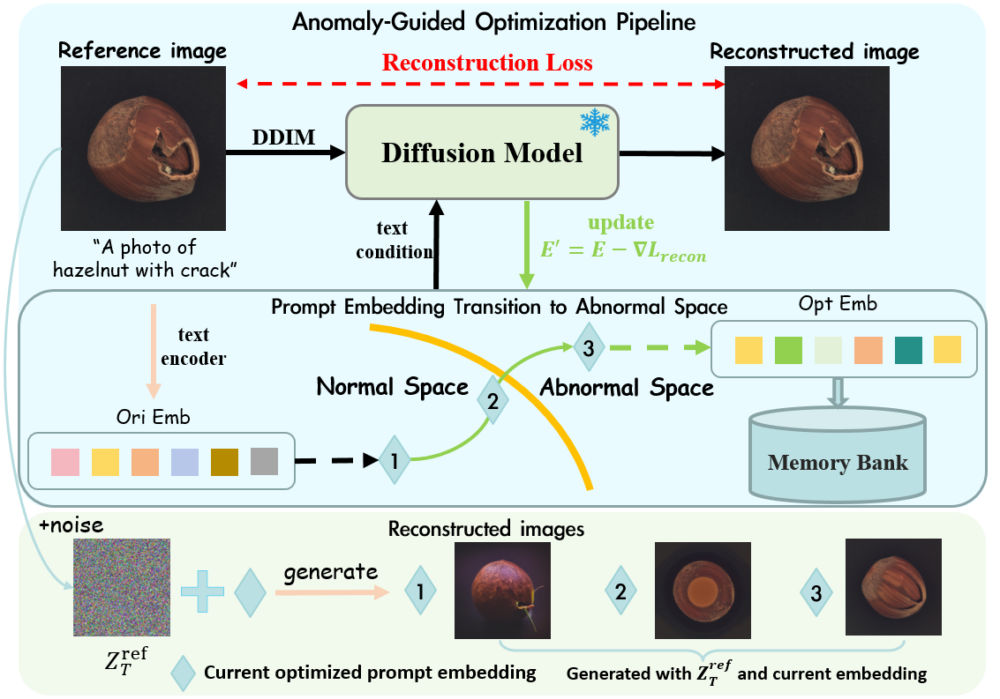
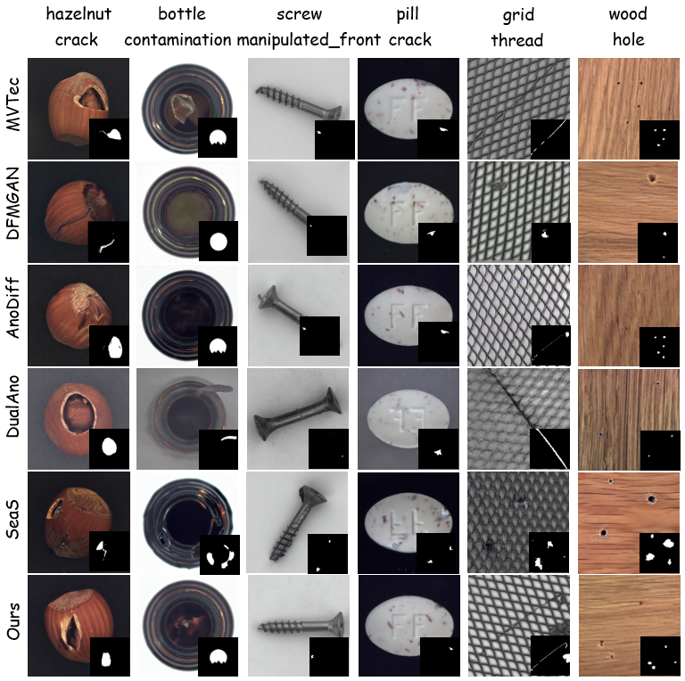
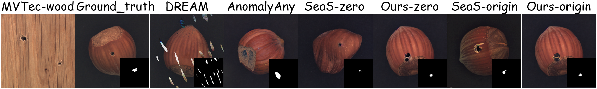
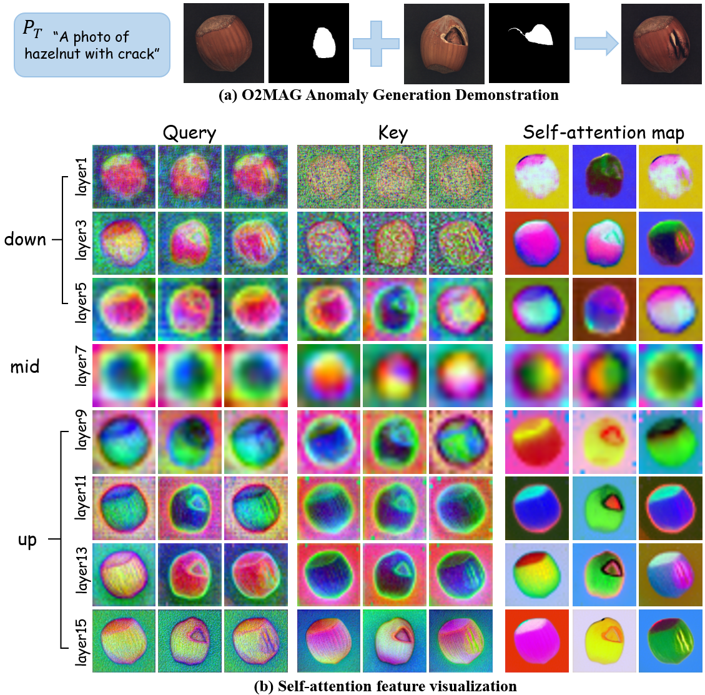
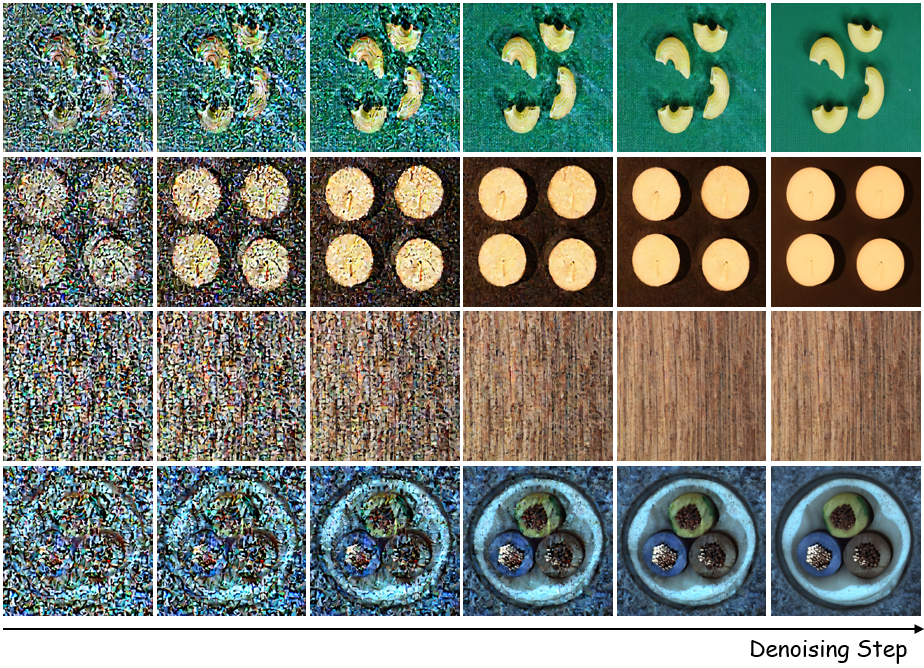
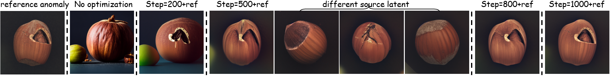
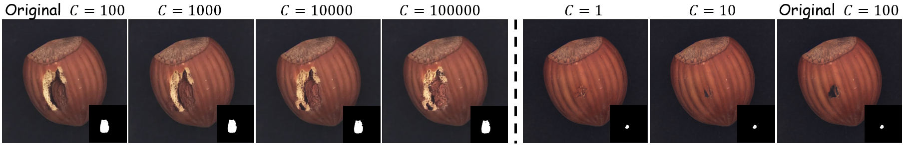

# One-to-More：基于注意力控制的高保真、无需训练异常生成

## 译文说明

本译文依据 arXiv:2603.18093v2 的 LaTeX 源码与本地 PDF 对照翻译，保留原文的章节结构、公式编号、表格数值、图表编号、引用编号、方法名与数据集名。图中对理解方法有实质作用的文字另行译出。参考文献保留原始书目信息，以免误译题名、作者或出版信息。原文中少量明显拼写问题（如 `cannot expressed`、`aboutlogical`、`moudle`）已在不改变含义的前提下按通顺中文译出；彼此不一致的符号、表号或 “DREAM / DRAEM” 等写法按原文保留，并在相应位置以译注标明。

**粗体**表示该指标最优，<u>下划线</u>表示次优。

Haoxiang Rao1，Zhao Wang2，Chenyang Si1，Yan LYU2，Yuanyi Duan3，Fang Zhao1,†，Caifeng Shan1,†

1 Nanjing University（南京大学）  
2 China Mobile Zijin Innovation Institute（中国移动紫金创新研究院）  
3 Shandong University of Science and Technology（山东科技大学）

echrao@smail.nju.edu.cn，{wangzh8, lvyansgs}@js.chinamobile.com  
{chenyang.si.mail, duanyuanyi46, zhaofang0627, caifeng.shan}@gmail.com

arXiv:2603.18093v2 [cs.CV]，2026 年 4 月 7 日

† 通讯作者。

CVPR 2026 投稿模板版本。

---

**图 1：左：** 基于扩散模型的异常生成方法比较。基于训练的方法要么（i）加入缺陷模块（defect block）以学习异常分布，要么（ii）通过文本反演（textual inversion）训练嵌入以模仿异常视觉风格；而（iii）现有无需训练方法 AnomalyAny 难以表达精确、真实的异常语义；（iv）本文提出的无需训练方法 O2MAG 能够在忠实保留背景的同时，合成多样且空间定位明确的异常。**右：** 无需训练方法 AnomalyAny 与本文 O2MAG 的对比。AnomalyAny 中皮革上的胶水（glue-on-leather）与线缆中的导线（wire-in-cable）偏离了真实缺陷分布。

> **图 1 内文字：** 方法比较；无需训练；模型微调 / 嵌入训练 / 交叉注意力编辑 / 本文 O2MAG；正常区域保留；异常语义保真；缺陷模块、DualAnoDiff、AnomalyDiffusion、自注意力嫁接、交叉注意力编辑；训练期微调 / 冻结 / 推理期优化；AnomalyAny 与本文生成异常对比；真实异常、AnomalyAny、本文；leather–cut、leather–glue、cable–bent_wire。

## 摘要

工业异常检测（anomaly detection，AD）的典型特点是正常图像充足、异常图像稀缺。尽管已有大量少样本异常合成方法被提出，用以扩充下游 AD 任务所需的异常数据，但现有方法大多需要耗时训练，且难以学到忠实于真实异常的分布，从而限制了在这些数据上训练的 AD 模型效果。为解决上述局限，我们提出一种无需训练的少样本异常生成方法 **O2MAG**（One-to-More Anomaly Generation）：利用 **一** 张参考异常图像中的自注意力，合成 **更** 多真实异常，以支持有效的下游异常检测。具体而言，O2MAG 通过自注意力嫁接（self-attention grafting）协同三个并行扩散过程，并引入异常掩码以缓解前景–背景查询混淆，从而合成紧贴真实异常分布、且受文本引导的异常。为弥合已编码异常文本提示与真实异常语义之间的鸿沟，我们进一步引入异常引导优化（Anomaly-Guided Optimization，AGO），使合成过程对齐目标异常分布，引导生成既真实又与文本一致的异常。此外，为缓解异常掩码内部生成偏弱的问题，生成过程中采用双注意力增强（Dual-Attention Enhancement，DAE），同时强化掩码区域上的自注意力与交叉注意力。大量实验验证了 O2MAG 的有效性，并表明其在下游 AD 任务上优于先前最先进方法。

## 1 引言

在工业制造中，涵盖检测、定位与分类的视觉异常检验，是质量控制与良率提升的基础 [24, 19]。然而，真实工业生产普遍存在数据不平衡，即正常图像充足、异常图像稀缺。仅在正常数据上训练虽能识别偏离正常分布的异常 [40, 23]，但精确的异常定位与分类仍需要足够数量、具有代表性且带标注的异常样本。因此，近期研究开始利用生成模型合成真实异常图像，以增强有监督异常检验 [9, 18]。

扩散模型 [30] 凭借稳定的迭代去噪与强条件控制能力，正逐步取代 GAN [11]，成为异常生成的主干 [6, 7, 8, 20, 44]。在扩散设定下，基于训练的方法可分为两类：模型微调（图 1(a.i)）与嵌入训练（图 1(a.ii)）。模型微调方法通常基于 DreamBooth [32]，适配主干网络，将稀有标识符词元绑定到异常概念，同时保留关键视觉属性 [1, 8, 20, 35]；许多方法还会附加一个缺陷模块，显式建模异常前景（例如 DualAnoDiff [20]、DefectDiffu [35]）。这类方法能够产生语义多样的异常图像，但正常区域往往得不到保留，从而显著降低合成图像的真实感。嵌入训练方法则冻结扩散主干，通过文本反演 [17, 18] 学习用于表示特定异常概念的异常嵌入 [10]。

然而，上述方法都需要大量训练算力与存储开销，这促使人们转向无需训练的替代方案。AnomalyAny [36]（图 1(a.iii)）通过精炼交叉注意力，使其关注异常词元并增强其激活，从而实现异常概念生成。然而，如图 1(b) 所示，它难以产生真实的异常外观，对异常类型与空间布局的控制有限，且无法生成像素级精确掩码，从而限制了下游异常检测与分类。为利用自注意力中丰富的全局布局与纹理信息，我们提出 O2MAG（图 1(a.iv)）：通过文本嵌入编辑与注意力调制，在指定区域内生成真实异常，同时保持背景保真，从而显著提升下游异常检测精度。

O2MAG 包含三个模块：用于异常特征迁移的主干——三分支注意力嫁接（Tri-branch Attention Grafting，TriAG）；用于精炼异常文本嵌入的异常引导优化（AGO）；以及用于确保目标掩码被完整填充的双注意力增强（DAE）。TriAG 是主干，包含三个扩散分支：参考异常分支、正常图像分支与目标异常分支。在目标掩码内部，自注意力嫁接模块实现跨分支信息交换：从前景参考分支查询异常特征，从正常分支查询背景特征，从而在无需任何模型微调的情况下生成多样的异常前景并保留正常背景。由于异常在 Stable Diffusion（SD）训练中相对稀缺，简单提示往往会偏向与工业缺陷不对齐的 LAION-5B [33] 先验，AGO 通过对参考异常图像施加重建损失，对异常文本嵌入做轻量优化，使整条流水线保持无需训练。最后，为防止掩码内部异常偏弱或不完整，DAE 在选定时间步将自注意力与交叉注意力重新加权到缺陷区域，从而改善小缺陷保真度以及与掩码一致的合成。在 MVTec-AD 数据集 [2] 上的定量评估显示，本方法将像素级 AP 提升 $+1.8\%$，F1-max 提升 $+2.0\%$，并将分类准确率提高 $+12.1\%$。本文主要贡献如下：

- 提出一种无需训练、少样本的三分支扩散框架：通过将参考异常分支与正常分支的自注意力嫁接到目标分支，合成掩码定位、背景忠实的异常。
- 在推理阶段，利用参考异常图像上的重建损失优化异常文本嵌入，从而在无需微调的情况下得到与目标域对齐的文本条件。
- 在去噪过程的特定时间步注入双注意力增强，提高掩码区域内的自注意力 / 交叉注意力权重，改善合成异常与掩码的对齐。

## 2 相关工作

### 2.1 异常生成

早期异常合成依赖手工数据增强来制造伪异常。CutPaste [22] 与 DRAEM [42] 将图像块或不相关纹理粘贴到正常图像上，而非建模完整图像分布，所生成的异常在几何或光度上往往不一致，真实感与多样性均受限。

**基于 GAN 的生成。** 随后，GAN [11] 被用于工业异常生成。SDGAN [27] 与 DefectGAN [43] 等方法学习正常域与异常域之间的映射以合成缺陷。DFMGAN [9] 采用两阶段方案，分别建模正常图像与异常图像的分布。然而，在异常稀缺设定下，GAN 容易出现模式崩塌与梯度不稳定 [26, 9]，多样性下降。

**基于扩散的生成。** 扩散模型因泛化能力强，越来越多地被用于异常合成。AnomalyDiffusion [18] 与 AnoGen [12] 冻结扩散主干，学习用于编码特定异常概念的异常嵌入 [10]，但往往遗漏细粒度缺陷结构。近期工作转向基于 DreamBooth 的微调：微调整个主干，将稀有标识符词元绑定到异常概念 [32]。DualAnoDiff [20] 将全局图像分支与缺陷块分支耦合以生成异常。DefectFill [35] 微调修复型扩散模型，使前景异常与稀有标识符相关联。SeaS [8] 进一步引入不平衡异常文本提示，以建模正常产品与多样异常之间的分布差异。然而，在少样本设定下，这些方法难以在忠实建模异常数据分布的同时避免过拟合。尽管付出了计算成本与漫长训练时间，训练得到的生成器仍明显偏离真实数据分布。

### 2.2 文本到图像的编辑与合成

图像编辑指将用户提供的条件（例如图像或文本）引入生成过程，以约束输出的结构与语义。Textual Inversion [10] 与 DreamBooth [32] 将用户图像特征绑定到稀有标识符词元，以实现个性化生成，但需要对每个对象进行大量微调，且对布局与背景的控制较弱。P2P [14] 与 Attend-and-Excite [5] 揭示了交叉注意力中编码的丰富语义，即文本词元与空间布局之间的对应关系。然而，交叉注意力由空间特征与词嵌入匹配而成，只能捕捉粗粒度的物体级区域，无法表达原始提示中未显式指定的局部空间细节。互补方法——包括 MasaCtrl [4]、PnP [37] 与 MCA-Ctrl [39]——编辑自注意力以约束全局结构与局部形变，从而支持更复杂的非刚性编辑。

尽管注意力中编码了丰富语义，面向工业异常合成的无需训练注意力调制仍较少被探索。无需训练方法 TF2 [41] 与 AnomalyAny [36] 缺乏细粒度的空间与语义控制。为解决上述问题，我们提出一种单样本、异常引导、无需训练的方法：通过操纵注意力特征来引导生成，从而实现更细粒度、更真实的异常合成，避免微调与大型检查点存储。

**图 2：所提出 O2MAG 的总览。** 本方法通过协调三个并行扩散过程中的自注意力来合成异常。DAE 作用于目标分支的自注意力 / 交叉注意力，以强制完整填充掩码；AGO 则精炼异常文本嵌入，使其语义与参考异常图像对齐，从而生成更真实的结果。

## 3 预备知识

### 3.1 Stable Diffusion

Stable Diffusion [30] 采用基于潜空间的策略：VAE 将 RGB 空间中的图像 $x\in\mathbb{R}^{H\times W\times 3}$ 映射到低维潜表示 $\boldsymbol{z}=\mathcal{E}(x)$，其中 $\boldsymbol{z}\in\mathbb{R}^{h\times w\times c}$。加噪与去噪均在该潜空间中进行，最终去噪输出再由解码器映射回像素空间：$\tilde{x}=\mathcal{D}(\boldsymbol{z})=\mathcal{D}(\mathcal{E}(x))$。模型包含 CLIP 文本编码器 [29] $\tau_\theta$，将文本条件 $y$ 投影为中间表示 $\tau_\theta(y)\in\mathbb{R}^{m\times d_\tau}$。条件 Stable Diffusion 可通过下式学习：

$$
L_{SD}:=\mathbb{E}_{\mathcal{E}(x),y,\epsilon\sim\mathcal{N}(0,1),t}\left[\|\epsilon-\epsilon_{\theta}(\boldsymbol{z}_{t},t,\tau_{\theta}(y))\|_{2}^{2}\right]. \tag{1}
$$

其中 $\boldsymbol{z}_t$ 表示扩散步 $t$ 上的加噪潜变量。

### 3.2 Stable Diffusion 中的注意力机制

SD 模型中的每个 U-Net 块 [31] 包含残差块 [13]、自注意力模块与交叉注意力模块 [38]。文本引导通过交叉注意力注入，自注意力则整合全局上下文以保持结构与边界。二者均作用于 $64\times 64$、$32\times 32$、$16\times 16$ 与 $8\times 8$ 分辨率的中间特征图。注意力图计算为：

$$
\boldsymbol{A}=\mathrm{softmax}\!\left(\frac{\boldsymbol{Q}\boldsymbol{K}^{\mathrm T}}{\sqrt{d_k}}\right). \tag{2}
$$

矩阵 $\boldsymbol{A}$ 表示查询 $\boldsymbol{Q}$ 与键 $\boldsymbol{K}$ 之间的相似度。随后用 $\boldsymbol{A}$ 聚合值 $\boldsymbol{V}$，得到注意力输出 $\mathrm{\boldsymbol{Attn}}(\boldsymbol{Q},\boldsymbol{K},\boldsymbol{V})=\boldsymbol{A}\,\boldsymbol{V}$。其中 $\boldsymbol{Q}$ 由空间特征投影得到；$\boldsymbol{K}$、$\boldsymbol{V}$ 则经由相应投影矩阵，从空间特征（自注意力）或文本嵌入（交叉注意力）投影得到。注意力输出随后用于更新空间特征。

已有研究表明，SD 的注意力层捕获全局布局与内容形成信号。交叉注意力将空间像素与文本嵌入对齐；自注意力特征可作为即插即用特征，注入特定 U-Net 层以实现图像变换。因此，我们通过操纵注意力特征来高效生成异常图像。

## 4 方法

我们提出 O2MAG：一种无需训练、少样本的扩散异常生成框架，利用扩散模型的内在先验。仅用一张参考异常图像，O2MAG 即可合成更多样、更真实的异常样本。如图 2 所示，O2MAG 包含三个并行扩散过程。通过自注意力特征嫁接，它在保留正常背景的同时编辑异常外观（第 4.1 节）。此外，异常引导优化模块（第 4.2 节）将文本提示嵌入与目标异常语义对齐，注入更丰富的缺陷语义以提升生成质量。同时，通过对交叉注意力与自注意力升权来增强异常区域内的响应，确保目标掩码被完整填充（第 4.3 节）。

### 4.1 三分支注意力嫁接（TriAG）

**图 3：** （a）迭代去噪过程中的中间重建；（b）第 30 个采样步上自注意力图 $A$ 的可视化。主成分保留图像布局，相同颜色渲染的区域共享语义属性。

本文利用 SD [30] 生成更多视觉异常。给定一对参考异常图像–掩码 $(I_{\mathrm{R}}, M_{\mathrm{R}})$、一张正常图像 $I_{\mathrm{N}}$ 以及目标异常掩码 $M_{\mathrm{T}}$，目标是合成更多异常图像 $\hat{I}$：它们符合给定文本提示，在 $M_{\mathrm{T}}$ 之外保留 $I_{\mathrm{N}}$ 的背景外观，并在 $M_{\mathrm{T}}$ 指定区域内迁移 $I_{\mathrm{R}}$ 的异常属性。

自注意力由查询–键投影的相似度构造注意力图 $\boldsymbol{A}$，编码各位置之间的成对空间亲和性。为进一步探究这种已建立的自相似性，我们对异常图像的自注意力图做主成分分析（PCA），并可视化前三个主成分：结构相似的区域呈现相近颜色。可视化显示，异常前景与正常背景在注意力空间中存在清晰分离（见图 3(b)）。这一分离，连同“对即插即用自注意力特征做免调参控制即可实现结构保持的一致合成与编辑”的已有证据，共同构成了我们的设计动机。我们保持当前查询特征 $\boldsymbol{Q}$ 不变，将自注意力的键 $\boldsymbol{K}$ 与值 $\boldsymbol{V}$ 替换为来自参考异常的对应量；后者编码异常内容与纹理，从而修改原始语义布局，并将掩码区域 $M_{\mathrm{T}}$ 导向异常语义。

如图 2 所示，TriAG 包含三个扩散过程：参考异常、正常图像与目标异常扩散分支。利用 DDIM 反演 [34]，参考异常图像 $I_{\mathrm{R}}$ 与正常图像 $I_{\mathrm{N}}$ 被映射为初始噪声图 $\boldsymbol{Z}_{T}^{\mathrm{ref}}$ 与 $\boldsymbol{Z}_{T}^{\mathrm{nor}}$。我们将目标异常扩散分支初始化为正常噪声图 $\boldsymbol{Z}_{T}^{\mathrm{tar}}=\boldsymbol{Z}_{T}^{\mathrm{nor}}$，以便继承正常内容。由于仅靠初始化无法保持背景保真，我们保留正常图像分支作为伴随分支，以提供背景先验。与 MasaCtrl [4] 不同，异常数据集中的图像以物体为中心，且物体结构在去噪早期即已出现（图 3(a)）。因此，我们从较早的去噪时间步 $T_S=5$ 开始注意力嫁接。此外，如图 3(b) 所示，U-Net 编码器中的自注意力尚不能捕获与修改后提示对齐的清晰布局。因此，我们在解码器部分的自注意力层 $L_S\in\{9,\dots,16\}$ 上编辑注意力。

具体而言，在去噪步 $t$ 与层 $l$，目标异常分支的查询 $\boldsymbol{Q}_{T,t,l}$ 分别关注参考异常分支与正常图像扩散分支的键，见式 (3)。为将异常前景与背景解耦，并严格约束目标扩散分支仅在目标区域内合成异常，我们用 $M_{\mathrm{R}}$ 与 $M_{\mathrm{T}}$ 掩蔽注意力矩阵：目标图像只被允许从参考分支查询前景异常特征（式 (4)），而正常分支只贡献正常背景内容（式 (5)）。最后，两个注意力结果由 $M_T$ 按式 (6) 门控融合，得到最终注意力输出。这种掩蔽将异常嫁接局部化到目标区域，从而实现可控、空间精确的异常合成。

$$
\boldsymbol{A}_{fg,t,l}=\frac{\boldsymbol{Q}_{T,t,l}\boldsymbol{K}_{R,l}^{\mathrm T}}{\sqrt{d}},\quad
\boldsymbol{A}_{bg,t,l}=\frac{\boldsymbol{Q}_{T,t,l}\boldsymbol{K}_{N,t,l}^{\mathrm T}}{\sqrt{d}} \tag{3}
$$

$$
\mathrm{\boldsymbol{Attn}}_{\mathrm{fg}}
=\mathrm{softmax}\!\big(\boldsymbol{A}_{fg,t,l}\odot \mathcal{MF}(M_R{=}0,-\infty)\big)\,\boldsymbol{V}_{R,t,l} \tag{4}
$$

$$
\mathrm{\boldsymbol{Attn}}_{\mathrm{bg}}
=\mathrm{softmax}\!\big(\boldsymbol{A}_{bg,t,l}\odot \mathcal{MF}(M_T{=}1,-\infty)\big)\,\boldsymbol{V}_{N,t,l} \tag{5}
$$

$$
\mathrm{\boldsymbol{Attn}}^{*}_{T,t,l} = M_T \odot \mathrm{\boldsymbol{Attn}_{fg}} + (1 - M_T)\odot \mathrm{\boldsymbol{Attn}_{bg}} \tag{6}
$$

其中 $d$ 为注意力头维度，$\odot$ 表示逐元素乘法。$\mathcal{MF}(\cdot)$ 为掩码填充算子。

### 4.2 异常引导优化（AGO）

我们采用简单文本提示模板 “A photo of a [cls] with a [anomaly_type]”，以指定物体类别与异常类型。然而，由于 SD 训练数据与工业异常数据集之间存在分布差异，模型缺乏忠实建模真实数据外观以及物体–异常属性语义关系的能力。因此，仅用简单文本引导生成时，会得到如图 4 中菱形标记所示的结果：正常外观与真实异常数据分布不一致，预期异常也未被传达。

**图 4：异常引导优化（AGO）流程。** 数字表示使用当前已优化提示嵌入、由 $\boldsymbol{Z}_T^{\mathrm{ref}}$ 合成的不同样本。

为弥合这一差距，我们提出一种轻量、单样本、由参考异常引导的提示优化，将正常文本语义映射到异常空间。目标文本 $y$ 首先由冻结的 CLIP 文本编码器 [29] $\tau_\theta$ 编码，得到原始嵌入

$$
\mathbf{\boldsymbol{e}}_{\mathrm{ori}}=\tau_\theta(y)\in\mathbb{R}^{m\times d_\tau},
$$

其中 $m$ 为词元数，$d_\tau$ 为词元嵌入维度。随后，将参考异常的 DDIM 反演噪声图与文本嵌入送入冻结的 SD。我们通过最小化式 (7) 中的重建损失来优化提示嵌入，从而将其从正常语义推向异常空间。优化后的嵌入能够保留物体外观，同时编码预期的异常属性。

$$
\mathbf{\boldsymbol{e}}^\star
= \arg\min_{\mathbf{\boldsymbol{e}}}\ \mathbb{E}_{t,\boldsymbol{\epsilon}}
\Big[\big\|\boldsymbol{\epsilon}-\epsilon_{\theta}(\mathbf{x}_t,\,t,\,\mathbf{\boldsymbol{e}})\big\|_2^2\Big]. \tag{7}
$$

我们进一步观察到，优化超参数的选择（例如优化步数与学习率）会显著影响优化后文本嵌入的质量。图 4 展示了使用参考图像反演噪声图、以及不同优化步数下（菱形标记）提示嵌入所生成的图像。使用原始或仅部分优化的嵌入，无法产生预期的物体外观与异常。精确参数设置见第 5.1 节。通过将最终优化的提示嵌入（文本级异常语义）与 TriAG 的图像级异常信息融合，本方法提升了异常真实感，并提供精确、可控的空间布局。

**负向提示。** 我们额外采用负向提示 [25]，使合成偏离正常外观。令 $y$ 为正向提示，$y_n$ 为负向提示（例如 “intact shell”“no crack”），由我们希望避免的正常外观短语构成。在本流水线中，$y_n$ 被编码并用作无条件嵌入。噪声通过标准无分类器引导（classifier-free guidance）计算。在每个采样步 $t$，噪声估计为：

$$
\hat{\epsilon}_t
=\epsilon_\theta(x_t, y_n, t)
+ g\,\big(\epsilon_\theta(x_t, y, t)-\epsilon_\theta(x_t, y_n, t)\big), \tag{8}
$$

其中 $g$ 为无分类器引导尺度。更多细节见附录。

### 4.3 双注意力增强（DAE）

生成过程中我们观察到：即使有优化后的异常文本嵌入与自注意力嫁接模块引导，生成的异常仍可能无法完全占据目标掩码，从而限制下游异常定位的提升。为此，我们在选定时间步引入双注意力增强（DAE），对缺陷区域内的交叉注意力与自注意力重新加权，以实现与掩码一致的合成。

自注意力图编码空间像素之间的成对相似度。因此，我们鼓励目标异常分支中的查询优先关注参考异常扩散分支中、位于参考掩码 $M_{\mathrm{R}}$ 内部的异常特征。具体而言，在前景异常区域内加入加性 logit 偏置 $\gamma$，并施加温度 $\tau_{\mathrm{fg}}$ 缩放，以放大掩码像素对目标图像中异常特征的吸引力。特别地，我们将式 (4) 修改为下式 (9)：

$$
\begin{aligned}
\hat{\boldsymbol{A}}_{\mathrm{fg},t,l}
&= \boldsymbol{A}_{\mathrm{fg},t,l} + \log(\gamma)\,\overline{M}_{R},\\
\mathrm{\hat{\boldsymbol{Attn}}}_{\mathrm{fg}}
&= \mathrm{softmax}\!\Bigl(
    \frac{\hat{\boldsymbol{A}}_{\mathrm{fg},t,l}}{\tau_{\mathrm{fg}}}
    + \mathcal{MF}(M_R{=}0,-\infty)
  \Bigr)\,\boldsymbol{V}_{R,t,l}.
\end{aligned} \tag{9}
$$

此外，交叉注意力图表示每个图像块在文本词元上的概率分布，并决定该块的主导词元。对于模板 “A photo of a [cls] with a [anomaly_type]” 的提示，我们希望在目标掩码内增强异常词元 *[anomaly_type]* 对最终图像的影响。我们观察到，优化之后，提示嵌入中异常词元的属性仍局部化在其原始词元位置，没有发生语义泄漏。因此，我们在式 (10) 中将分配给 *[anomaly_type]* 的注意力缩放 $C=100$ 倍（其余词元注意力保持不变），从而增强其在掩码区域内对合成的作用。

$$
\mathcal{F}\!\left(\boldsymbol{A}_{\mathrm{c},t}, M_T\right)_{i,j}
=
\begin{cases}
C\cdot M_T \cdot \big(\boldsymbol{A}_{\mathrm{c},t}\big)_{i,j}, & j = j^{*},\\
\big(\boldsymbol{A}_{\mathrm{c},t}\big)_{i,j}, & \text{otherwise.}
\end{cases} \tag{10}
$$

索引 $i$ 表示像素位置，列索引 $j$ 对应文本词元，$j^{*}$ 指示 *[anomaly_type]* 词元的位置。我们用时间戳 $\tau_s$ 门控自注意力增强，用 $\tau_c$ 门控交叉注意力增强。

最后，O2MAG 的整体流程总结于附录 A 的算法 1。在我们的设定中，TriAG 在物体形状出现之后、从去噪步 $T_S$ 开始、在指定层 $\ell\in L_S$ 上执行自注意力编辑。DAE 模块包含自注意力与交叉注意力增强：交叉注意力在 $t\in\tau_c$ 时触发，自注意力在 $t\in\tau_s$ 时触发。因此，在去噪步 $t$ 与自注意力层 $\ell$，算法 1 中的注意力 **EDIT** 函数由下式给出：

$$
\mathrm{\textbf{EDIT}} :=
\begin{cases}
\mathrm{TriAG}, & \text{if } t > T_{S} \text{ and } \ell \in \mathrm{L}_{S},\\
\mathrm{DAE},   & \text{if } t \in \tau_s \text{ or } t \in \tau_c,\\
\textit{Self-Attention}(\{\boldsymbol{Q}_T, \boldsymbol{K}_T, \boldsymbol{V}_T\}), & \text{otherwise}.
\end{cases} \tag{11}
$$

$\textit{Self-Attention}$ 表示标准自注意力操作 [38]。重要的是，O2MAG 无需任何微调，即可利用 SD 模型内部的丰富知识完成同类别异常特征迁移，从而产生多样、真实的异常。此外，它还能在零样本设定下扩展到跨类别异常合成，以扩大参考异常数据池（见第 5.3 节）。

## 5 实验

### 5.1 实验设置

**数据集。** 我们在 MVTec-AD 数据集 [2] 上开展实验。该数据集包含 15 个产品类别，每类最多有八种异常类型。遵循 DualAnoDiff [20] 及相关工作的少样本实验设定，我们将前三分之一图像作为参考异常图像，在剩余三分之二上评估。

**评估指标。** **1）异常生成。** 我们用 Kernel Inception Distance（KID）[3] 与簇内成对 LPIPS 距离（Intra-cluster pairwise LPIPS，IC-LPIPS）[28] 评估生成质量与多样性。用于评估图像质量的 KID 是无偏估计量，在小数据集上比 FID [15] 更可靠。**2）异常检验。** 我们用 AUROC、AP 与 $F_1$-max 评估检测与定位，并用 Accuracy 报告异常分类。

**实现细节。** 我们部署预训练的 Stable Diffusion v1.5 [30]，使用 50 步去噪进行异常合成，不进行额外训练。在 AGO 期间，我们在 $64\times 64$ 扩散阶段用 Adam [21]、固定学习率 $3\times 10^{-3}$，对异常文本嵌入优化 500 步。更多细节见附录。

### 5.2 异常生成对比

**基线。** 我们将本方法与现有异常生成方法进行对比。最相关的无需训练方法是 TF2 [41] 与 AnomalyAny [36]。然而，TF2 没有公开代码，且只报告了 KID 与分类准确率；AnomalyAny 缺少其设计的文本提示，也未说明用于下游异常检测的掩码生成流程。因此，我们主要与基于训练的少样本异常生成方法比较——DFMGAN [9]、AnomalyDiffusion [18]、DualAnoDiff [20] 与 SeaS [8]——并从三项任务评估：（i）异常生成质量；（ii）异常检测与定位；（iii）分类。为完整起见，我们在表 3 中给出 AnomalyAny 的检测结果，并仅在分类对比中纳入 TF2，使用其论文报告的结果。

**表 1：在 MVTec-AD 上，用生成数据训练的 U-Net 分割模型 [31] 进行异常检测与定位的对比。**

| Category | DFMGAN [9] AP-I / AUC-P / AP-P / F1-P | AnomalyDiffusion [18] AP-I / AUC-P / AP-P / F1-P | DualAnoDiff [20] AP-I / AUC-P / AP-P / F1-P | SeaS [8] AP-I / AUC-P / AP-P / F1-P | Ours AP-I / AUC-P / AP-P / F1-P |
| --- | --- | --- | --- | --- | --- |
| bottle | 99.8 / 98.9 / 90.2 / 83.9 | <u>99.9</u> / 99.4 / 94.1 / 87.3 | **100** / <u>99.5</u> / 93.4 / 85.7 | <u>99.9</u> / **99.7** / **95.9** / **88.8** | **100** / **99.7** / <u>95.4</u> / <u>88.4</u> |
| cable | 97.8 / 97.2 / 81.0 / 75.4 | **100** / <u>99.2</u> / <u>90.8</u> / <u>83.5</u> | 98.3 / 98.5 / 82.6 / 76.9 | <u>98.8</u> / 96.0 / 83.1 / 77.7 | **100** / **99.4** / **91.2** / **85.0** |
| capsule | 98.5 / 79.2 / 26.0 / 35.0 | **99.9** / <u>98.8</u> / <u>57.2</u> / <u>59.8</u> | 99.2 / **99.5** / **73.2** / **67.0** | 99.2 / 93.7 / 41.9 / 47.3 | <u>99.8</u> / 97.0 / <u>60.6</u> / 59.0 |
| carpet | 98.5 / 90.6 / 33.4 / 38.1 | 98.8 / 98.6 / 81.2 / 74.6 | <u>99.9</u> / <u>99.4</u> / **89.1** / **80.2** | 99.0 / 99.3 / 86.4 / 78.1 | **100** / **99.5** / <u>88.5</u> / <u>80.0</u> |
| grid | 90.4 / 75.2 / 14.3 / 20.5 | 99.5 / 98.3 / 52.9 / 54.6 | 99.7 / 98.5 / 57.2 / 54.9 | <u>99.9</u> / **99.7** / <u>76.3</u> / <u>70.0</u> | **100** / <u>99.6</u> / **78.6** / **71.6** |
| hazelnut | **100** / <u>99.7</u> / 95.2 / 89.5 | <u>99.9</u> / **99.8** / <u>96.5</u> / <u>90.6</u> | **100** / **99.8** / **97.7** / **92.8** | 99.8 / 99.5 / 92.3 / 85.6 | **100** / **99.8** / 96.2 / 90.1 |
| leather | **100** / 98.5 / 68.7 / 66.7 | **100** / 99.8 / 79.6 / 71.0 | **100** / **99.9** / **88.8** / <u>78.8</u> | **100** / <u>99.8</u> / 85.2 / 77.0 | **100** / 99.7 / <u>88.0</u> / **79.7** |
| metal_nut | 99.8 / 99.3 / 98.1 / <u>94.5</u> | **100** / **99.8** / <u>98.7</u> / 94.0 | <u>99.9</u> / <u>99.6</u> / 98.0 / 93.0 | **100** / **99.8** / **99.2** / **95.7** | **100** / **99.8** / **99.2** / **95.7** |
| pill | 91.7 / 81.2 / 67.8 / 72.6 | <u>99.6</u> / <u>99.7</u> / 93.9 / **90.8** | 99.0 / 99.6 / 95.8 / 89.2 | <u>99.6</u> / **99.9** / **97.1** / <u>90.7</u> | **99.7** / <u>99.7</u> / <u>96.1</u> / 89.9 |
| screw | 64.7 / 58.8 / 2.2 / 5.3 | 97.9 / 97.0 / 51.8 / 50.9 | 95.0 / 98.1 / 57.1 / 56.1 | <u>98.0</u> / <u>98.5</u> / <u>58.5</u> / <u>57.2</u> | **98.2** / **99.4** / **68.2** / **64.4** |
| tile | **100** / 99.5 / 97.1 / 91.6 | **100** / 99.2 / 93.6 / 86.2 | **100** / 99.7 / 97.1 / 91.0 | **100** / <u>99.8</u> / <u>97.9</u> / <u>92.5</u> | **100** / **99.9** / **98.2** / **92.7** |
| toothbrush | **100** / 96.4 / <u>75.9</u> / <u>72.6</u> | **100** / **99.2** / **76.5** / **73.4** | 99.7 / 98.2 / 68.3 / 68.6 | **100** / <u>98.4</u> / 70.0 / 68.1 | **100** / 96.3 / 58.6 / 59.2 |
| transistor | 92.5 / 96.2 / 81.2 / 77.0 | **100** / <u>99.3</u> / <u>92.6</u> / <u>85.7</u> | <u>93.7</u> / 98.0 / 86.7 / 79.6 | 99.5 / 98.0 / 87.3 / 81.9 | **100** / **99.9** / **98.2** / **93.2** |
| wood | 99.4 / 95.3 / 70.7 / 65.8 | 99.4 / **98.9** / 84.6 / 74.5 | **99.9** / 99.4 / **91.6** / **83.8** | 99.6 / 99.0 / 87.0 / 79.6 | <u>99.8</u> / <u>99.4</u> / <u>89.4</u> / <u>81.1</u> |
| zipper | <u>99.9</u> / 92.9 / 65.6 / 64.9 | **100** / <u>99.6</u> / 86.0 / 79.2 | **100** / <u>99.6</u> / **90.7** / **82.7** | **100** / **99.7** / 88.2 / <u>81.6</u> | **100** / 99.5 / <u>88.5</u> / <u>82.0</u> |
| **Average** | 94.8 / 90.0 / 62.7 / 62.1 | 99.7 / 99.1 / 81.4 / 76.3 | 98.9 / 99.1 / 84.5 / 78.8 | 99.6 / 98.7 / 83.1 / 78.1 | **99.8** / **99.2** / **86.3** / **80.8** |

**异常图像生成质量。** 代表性异常图像–掩码对见图 5，定量结果汇总于表 2。我们用 Kernel Inception Distance（KID；越低越好）评估保真度，用 IC-LPIPS（越高越好）衡量多样性。在我们的设定中，异常掩码由 AnomalyDiffusion [18] 生成。如表 2 所示，本方法在各类别上取得更低的 KID，表明更接近真实异常分布。我们的 IC-LPIPS 较低，主要是因为异常被合成到来自有限训练集、仅做简单增强的正常图像上，并且异常区域之外的正常背景得到了更好保留。相比之下，DualAnoDiff [20] 等方法可能破坏背景，抬高 IC-LPIPS 的同时损害保真度，如图 5 所示。

**表 2：MVTec 上 KID 与 IC-LPIPS 的对比。** 粗体与下划线分别表示最优与次优。本方法生成的异常图像最接近真实分布，取得最低 KID。尽管我们的 IC-LPIPS 低于部分方法，但后者较高的 IC-LPIPS 部分来自对正常背景的破坏。

| Category | DFMGAN [9] KID↓ / IC-L↑ | AnoDiff [18] KID↓ / IC-L↑ | DualAno [20] KID↓ / IC-L↑ | SeaS [8] KID↓ / IC-L↑ | Ours KID↓ / IC-L↑ |
| --- | --- | --- | --- | --- | --- |
| bottle | <u>70.90</u> / 0.12 | 137.71 / 0.17 | 151.09 / **0.31** | 148.29 / <u>0.21</u> | **42.78** / 0.17 |
| cable | <u>61.68</u> / 0.25 | 88.44 / 0.40 | 86.01 / **0.45** | 108.62 / **0.43** | **28.93** / 0.41 |
| capsule | <u>40.63</u> / 0.11 | 111.30 / 0.18 | 72.82 / <u>0.32</u> | 183.11 / 0.29 | **22.71** / 0.17 |
| carpet | **25.14** / 0.13 | 107.87 / 0.21 | 56.80 / **0.27** | 127.62 / <u>0.26</u> | <u>45.10</u> / **0.29** |
| grid | 101.04 / 0.13 | <u>51.55</u> / **0.45** | 64.13 / <u>0.44</u> | 60.85 / 0.41 | **7.04** / 0.38 |
| hazelnut | <u>21.16</u> / 0.24 | 65.70 / 0.28 | 40.20 / **0.37** | 46.96 / <u>0.31</u> | **9.54** / 0.30 |
| leather | **75.85** / 0.17 | 221.43 / **0.39** | 208.71 / <u>0.35</u> | 199.18 / **0.39** | <u>168.22</u> / 0.34 |
| metal_nut | <u>44.04</u> / <u>0.32</u> | 102.11 / 0.26 | 63.60 / **0.33** | 116.17 / <u>0.32</u> | **43.07** / 0.29 |
| pill | 123.52 / 0.16 | <u>64.44</u> / 0.23 | 153.44 / **0.41** | 77.70 / <u>0.31</u> | **39.76** / 0.24 |
| screw | <u>9.53</u> / 0.14 | 10.03 / 0.29 | 36.81 / **0.39** | 34.47 / <u>0.33</u> | **1.48** / <u>0.33</u> |
| tile | <u>85.28</u> / 0.22 | 181.28 / 0.48 | **57.95** / <u>0.49</u> | 170.94 / **0.51** | 114.94 / 0.46 |
| toothbrush | 46.49 / 0.18 | <u>42.33</u> / 0.17 | 59.79 / **0.48** | 103.66 / <u>0.31</u> | **10.75** / 0.20 |
| transistor | <u>88.31</u> / 0.25 | 118.70 / 0.30 | 119.12 / <u>0.32</u> | 105.39 / **0.36** | **46.41** / <u>0.32</u> |
| wood | 68.13 / 0.35 | 74.62 / 0.35 | <u>52.17</u> / <u>0.39</u> | 130.96 / **0.48** | **36.64** / 0.38 |
| zipper | <u>78.08</u> / 0.27 | 162.58 / 0.24 | 335.47 / **0.41** | 271.11 / <u>0.30</u> | **65.84** / 0.25 |
| **Average** | <u>62.85</u> / 0.20 | 102.67 / 0.29 | 103.87 / **0.38** | 125.67 / <u>0.35</u> | **45.55** / 0.30 |

**用于异常检测与定位的异常生成。** 我们评估生成数据对异常检测与定位的有效性，并与现有异常生成方法比较。对每种方法，我们合成 1,000 对图像–掩码，用于训练 U-Net 分割模型 [31]，协议遵循 AnomalyDiffusion [18] 与 DualAnoDiff [20]。我们报告图像级 AP（AP-I）以及像素级指标（表 1 中的 AUROC-P、AP-P 与 F1-P）；额外的图像级结果（AUROC-I、$F_1$-max）见附录 H。本方法在所有报告指标上均取得最佳性能。

**用于异常分类的异常生成。** 为衡量合成数据对下游任务的质量，我们按 AnomalyDiffusion [18] 的协议，在生成图像上训练 ResNet-34 [13] 分类器。如表 4 所示，本方法在各类别上取得最佳分类准确率，相对先前最先进方法 AnomalyDiffusion [18] 提升 12.1 个百分点，表明合成的异常图像更真实。此外，O2MAG 相对无需训练的 TF2 [41] 提升 20.47 个百分点。我们将这一差距归因于：TF2 在潜特征层面迁移缺陷特征（更粗、语义更不精确），而本方法执行细粒度注意力编辑，从而得到更忠实、更对齐真实分布的异常。

**图 5：MVTec-AD 上生成结果的定性对比。** 右下角子图为异常掩码。

**表 3：在 MVTec-AD 上与无需训练方法 AnomalyAny 的对比。**

| Metric | AUC-I | F1-I | AUC-P | F1-P |
| --- | --- | --- | --- | --- |
| AnomalyAny | 98.4 | 96.9 | 97.4 | 65.1 |
| Ours | 99.6 (**+1.2**) | 99.2 (**+2.3**) | 99.2 (**+1.8**) | 80.6 (**+15.5**) |

**表 4：用各方法合成图像训练的 ResNet-34 [13] 的异常分类准确率（%）。**

| Category | DFMGAN [9] | AnoDiff [18] | TF2 [41] | DualAno [20] | SeaS [8] | Ours |
| --- | --- | --- | --- | --- | --- | --- |
| bottle | 56.59 | **88.37** | 79.36 | 67.44 | 81.40 | <u>86.05</u> |
| cable | 45.31 | **76.56** | <u>60.00</u> | 57.81 | 48.44 | **76.56** |
| capsule | 37.23 | 44.00 | <u>53.12</u> | 50.67 | 33.33 | **77.33** |
| carpet | 47.31 | 58.06 | 55.05 | <u>62.90</u> | 38.71 | **74.19** |
| grid | 40.83 | 60.00 | 47.36 | <u>67.50</u> | 47.50 | **80.00** |
| hazelnut | 81.94 | 81.25 | <u>88.88</u> | 79.17 | 81.25 | **95.83** |
| leather | 49.73 | 65.08 | 46.06 | <u>84.13</u> | 61.90 | **92.06** |
| metal_nut | 64.58 | <u>82.81</u> | 72.04 | 73.44 | 68.75 | **84.38** |
| pill | 29.52 | <u>64.58</u> | 34.75 | 41.67 | 18.75 | **72.92** |
| screw | 37.45 | 29.63 | <u>40.33</u> | 39.51 | **56.79** | **56.79** |
| tile | 74.85 | <u>92.98</u> | 88.09 | **100.0** | 89.47 | **100.0** |
| transistor | 52.38 | 75.00 | 67.50 | <u>78.57</u> | 57.14 | **92.86** |
| wood | 49.21 | <u>78.57</u> | 70.00 | **90.48** | 76.19 | <u>78.57</u> |
| zipper | 27.64 | **86.59** | 63.86 | 24.39 | 34.15 | <u>85.37</u> |
| **Average** | 49.61 | <u>70.25</u> | 61.88 | 65.55 | 56.70 | **82.35** |

> **译注：** 原文表 4 未列出 toothbrush 类别。

### 5.3 零样本跨类别生成

如第 4.1 节所述，自注意力编码了丰富的缺陷信息，且绑定到同一 *[anomaly_type]* 的异常属性可以跨物体类别 *[cls]* 迁移。我们通过将全部 *wood-hole* 测试图像作为参考图像、引导合成 *hazelnut-hole*，评估 O2MAG 的零样本能力（图 6）。生成过程中，我们只访问 *wood-hole* 的异常图像与 *hazelnut* 的正常图像。

我们还测试基线能否在零样本设定下工作。其中仅 SeaS [8] 与 AnomalyAny [36] 支持该设定。SeaS 被设计为使用不平衡异常提示

$$
P=\text{“a <ob> with <df$_1$>, <df$_2$>, }\ldots\text{, <df$_N$>”}\quad (N=4),
$$

其中 `<ob>` 捕获正常 *[cls]* 外观，`<df$_n$>` 编码 *[anomaly_type]* 特征。为进行跨类别迁移，我们用 *wood–hole* 异常图像与 *hazelnut* 正常图像重新训练 SeaS，使异常词元 `<df$_n$>` 绑定 *hole* 缺陷，正常词元 `<ob>` 捕获类别外观。我们进一步与拷贝–粘贴方法 DRAEM [42] 比较。如图 6 所示，O2MAG 将 *hole* 缺陷从 *wood* 迁移到 *hazelnut*，同时保留掩码外的正常外观。我们还在合成的图像–掩码对上训练 U-Net 进行检测。如表 5 所示，尽管该零样本设定不及使用真实异常样本训练，但仍能取得有竞争力的性能。

**图 6：生成的 *hazelnut-hole* 的定性对比。**

**表 5：MVTec-AD 的 *hazelnut–hole* 子集上，零样本设定与原始设定的异常检测对比。**

| Method | Image-level AUC-I / AP-I / F1-I | Pixel-level AUC-P / AP-P / F1-P |
| --- | --- | --- |
| DREAM | 99.6 / 99.1 / 94.7 | 99.3 / 74.8 / 73.3 |
| AnomalyAny | 100.0 / 100.0 / 100.0 | 98.6 / 78.8 / 75.0 |
| SeaS-zero | 100.0 / 100.0 / 100.0 | 97.5 / 78.6 / 73.7 |
| Ours-zero | 100.0 / 100.0 / 100.0 | 99.1 / 86.8 / 80.2 |
| SeaS-origin | 100.0 / 100.0 / 100.0 | 99.2 / 87.3 / 80.0 |
| Ours-origin | 100.0 / 100.0 / 100.0 | 99.1 / 90.4 / 84.8 |

> **译注：** 表中方法名写作 DREAM，结合正文与引用 [42]，应指 DRAEM。

### 5.4 消融实验

我们评估三个组件的有效性：三分支注意力嫁接（TriAG）、双注意力增强（DAE）与异常引导优化（AGO）。具体考虑四种配置：1）仅 TriAG；2）TriAG + DAE；3）TriAG + AGO；4）完整框架。对每种配置与每种异常类型，我们合成 1000 张图像，并训练 U-Net 分割模型进行像素级检测。表 6 表明，去掉任一提出的模块都会降低检测性能，从而证实各组件的有效性。更多实验细节见附录。

**表 6：组件消融。** ✓ 表示启用。

| TriAG | DAE | AGO | AUROC↑ | AP↑ | F1-max↑ |
| --- | --- | --- | --- | --- | --- |
| ✓ |  |  | 99.0 | 81.9 | 77.6 |
| ✓ | ✓ |  | 99.0 | 83.3 | 77.9 |
| ✓ |  | ✓ | 99.1 | 82.7 | 77.7 |
| ✓ | ✓ | ✓ | 99.2 | 86.3 | 80.8 |

## 6 结论

我们提出 O2MAG，一种无需训练的少样本异常生成方法。受“异常前景与正常背景在自注意力中可分离”这一观察启发，O2MAG 协调三个并行扩散分支上的注意力，并用掩码引导将缺陷与背景解耦，从而产生与文本一致、真实的异常。为缓解语义漂移，我们引入轻量的异常引导优化以强化异常语义。该无需训练方法还允许使用来自其他物体类别、但属于同一异常类型的异常来引导合成。在无需模型训练的前提下，O2MAG 合成忠实于分布的异常，并在下游检测性能上优于最先进的基于训练的方法。

## 致谢

本研究得到国家自然科学基金（No. 62476124）、教育部基础学科与交叉学科突破计划（JYB2025XDXM902）、江苏省自然科学基金（No. BK20242015）、姑苏创新创业领军人才（No. ZXL2025322）、中央高校基本科研业务费（KG2025XX）、江苏省科技重大项目（BG2025035）以及南京大学–中国移动通信集团有限公司联合研究院的支持。本研究亦得到南京鲲鹏昇腾培育中心及产业合作方的现金与实物资助。

---

# 附录

## 概览

本补充材料提供对正文的额外细节与结果，具体包括：

- **A 节** 描述 O2MAG 异常生成的算法流程。
- **B 节** 给出额外的自注意力特征分析，为 TriAG 模块的自注意力编辑设计提供进一步可解释性。
- **C 节** 补充更多实验细节与计算开销。
- **D 节** 提供零样本跨类别异常生成的额外实验结果。
- **E 节** 给出各组件消融的定性可视化结果。
- **F 节** 在相同设定下展示 O2MAG 在 VisA 数据集上的性能。
- **G 节** 在单参考设定下展示 O2MAG 在 Real-IAD 数据集上的性能。
- **H 节** 报告 MVTec-AD 上异常图像生成的更多定性与定量结果。
- **I 节** 分析 O2MAG 的局限，并讨论潜在改进方向。

## 算法 1：O2MAG 的异常生成流程

**输入：** 参考图像–掩码对 $(I_{\mathrm{R}}, M_{\mathrm{R}})$，正常图像 $I_{\mathrm{N}}$，目标异常掩码 $M_{\mathrm{T}}$，异常文本提示 $y$。  
**输出：** 生成的异常图像 $\hat{I}$。

1. $e^\star \gets \mathrm{TextEncoder}(y) - \nabla_{e}\,L_{\text{recon}}\!\big(I_{\mathrm{R}},\,\hat{I}_{\mathrm{R}}\big)$  ▷ AGO
2. $\{\boldsymbol{Z}_T^{\mathrm{ref}}, \boldsymbol{Z}_{T-1}^{\mathrm{ref}}, \ldots, \boldsymbol{Z}_0^{\mathrm{ref}}\} \gets \mathrm{Inversion}(I_{\mathrm{R}})$
3. $\{\boldsymbol{Z}_T^{\mathrm{nor}}, \boldsymbol{Z}_{T-1}^{\mathrm{nor}}, \ldots, \boldsymbol{Z}_0^{\mathrm{nor}}\} \gets \mathrm{Inversion}(I_{\mathrm{N}})$
4. $\boldsymbol{Z}_T^{\mathrm{tar}} \gets \boldsymbol{Z}_T^{\mathrm{nor}}$
5. **for** $t = T, T-1, \ldots, 1$ **do**
6. $\quad \{\boldsymbol{Q}_R, \boldsymbol{K}_R, \boldsymbol{V}_R\} \gets \epsilon_{\theta}(\boldsymbol{Z}_t^{\mathrm{ref}}, t)$  ▷ 参考异常扩散分支
7. $\quad \{\boldsymbol{Q}_N, \boldsymbol{K}_N, \boldsymbol{V}_N\} \gets \epsilon_{\theta}(\boldsymbol{Z}_t^{\mathrm{nor}}, t)$  ▷ 正常图像扩散分支
8. $\quad \{\boldsymbol{Q}_T, \boldsymbol{K}_T, \boldsymbol{V}_T\} \gets \epsilon_{\theta}(\boldsymbol{Z}_t^{\mathrm{tar}}, t)$  ▷ 目标异常扩散分支
9. $\quad \boldsymbol{\mathrm{Attn}}^{\star} \gets \mathrm{\textbf{EDIT}}(\{\boldsymbol{Q}_T,\boldsymbol{K}_R,\boldsymbol{V}_R\},\{\boldsymbol{Q}_T,\boldsymbol{K}_N,\boldsymbol{V}_N\}, M_{\mathrm{R}}, M_{\mathrm{T}})$  ▷ 按式 (10) 编辑注意力（DAE 与 TriAG）
10. $\quad \varepsilon \gets \epsilon_{\theta}(\boldsymbol{Z}_t^{\mathrm{tar}}, t, \boldsymbol{\mathrm{Attn}}^{\star}, e^\star)$  ▷ 噪声预测
11. $\quad \boldsymbol{Z}_{t-1}^{\mathrm{tar}} \gets \mathrm{SampleDDIM}(\boldsymbol{Z}_t^{\mathrm{tar}}, \varepsilon, t)$  ▷ DDIM 步
12. **end for**
13. $\hat{I} \gets \mathrm{Decode}(\boldsymbol{Z}_0^{\mathrm{tar}})$
14. **return** $\hat{I}$

> **译注：** 算法注释写“按式 (10) 编辑注意力”，而正文中完整 EDIT 规则为式 (11)；式 (10) 仅对应交叉注意力缩放。此处按原文保留。

## A. O2MAG 的算法描述

算法 1 概述了 O2MAG 合成异常样本的流程。给定参考异常图像–掩码对 $(I_{\mathrm{R}}, M_{\mathrm{R}})$、正常图像 $I_{\mathrm{N}}$ 与目标异常掩码 $M_{\mathrm{T}}$，目标是生成异常图像 $\hat{I}$：在 $M_{\mathrm{T}}$ 之外保留正常外观，同时在 $M_{\mathrm{T}}$ 内部产生真实、与文本一致的缺陷。我们首先通过异常引导优化模块（第 4.2 节）将文本条件与异常语义对齐，精炼输入提示以得到对齐异常的文本嵌入。随后流水线运行三个并行扩散分支：分别处理 $I_{\mathrm{R}}$ 与 $I_{\mathrm{N}}$ 加噪版本的**参考–异常**分支与**正常–背景**分支，以及用 $I_{\mathrm{N}}$ 的加噪潜变量初始化的**目标–异常**分支，以便更好地保留结构与背景。采样期间，我们在选定时间步与注意力层上，用 **EDIT** 函数（式 (10)）跨三个分支操纵注意力。注意力编辑机制包括：（i）自注意力中的**三分支注意力嫁接**（TriAG），将参考分支的异常线索与正常分支的背景线索注入目标分支；（ii）**双注意力增强**（DAE），同时放大交叉注意力与自注意力响应。二者共同产生忠实于目标分布的异常，并改善下游检测性能。

## B. 面向异常生成的自注意力分析

如第 4.1 节所示，我们对异常图像的自注意力图做主成分分析（PCA），并可视化前三个主成分：结构相似的区域以相近颜色渲染。我们进一步展示查询（Q）、键（K）以及所得自注意力图 $\boldsymbol{A}=\mathrm{softmax}\!\left(\frac{\boldsymbol{Q}\boldsymbol{K}^{\mathrm T}}{\sqrt{d_k}}\right)$，以阐明 TriAG 的自注意力嫁接机制，见图 7。

如图 7 所示，浅层注意力与图像的语义布局对齐，按物体部件对区域分组并捕获粗结构。更深的层逐渐转向高频内容，揭示细粒度、块级纹理线索。空间分辨率沿 U-Net 路径变化——从 $64\times 64$ 下采样到 $8\times 8$，再上采样回 $64\times 64$。由于在我们的设定中，下采样块与中间块提供的自注意力信息有限，我们将其省略，主要在上采样块（第 10–16 层）上执行自注意力嫁接。

**图 7：** （a）O2MAG 异常生成示意；（b）第 30 个去噪步上可视化的自注意力特征图。每组三张子图从左到右依次对应正常图像、参考异常图像与生成图像。

**图 8：迭代去噪过程中的中间重建。** 对纹理类与物体类，全局图像布局都在去噪早期即已形成。

## C. 更多实验细节

### C.1 更多实现细节

**数据准备。** 我们对 MVTec-AD 训练集中的正常图像（每类约 200–400 张；toothbrush 仅有 60 张）进行平移、翻转与旋转增强。对每个类别，通过数据增强将正常图像训练集扩充到 1000 张。对方向敏感的类别（例如 zipper、capsule），我们仅使用翻转以保留规范语义。这种轻量增强，加上本方法对正常背景区域的出色保留，可能部分解释了相对某些基线更低的 IC-L。即便如此，本方法仍能产生真实且多样的异常。我们采用 AnomalyDiffusion 生成的异常掩码作为目标掩码。由于 AnomalyDiffusion 偶尔会产生空掩码（全零），我们生成 1,200 个掩码，过滤空掩码后保留 1,000 个有效掩码。

**实验细节与超参数。** 我们部署预训练的 Stable Diffusion v1.5 [30]，使用 50 步去噪，并将无分类器引导 [16] 设为 7.5，进行无需额外训练的异常合成。

**(1) TriAG 的额外分析：** 如图 8 所示，异常数据集中的图像结构相对简单，布局在去噪早期即出现。因此，我们从第 5 个去噪步开始启用自注意力编辑。与第 4.1 节及 B 节一致，我们在携带细粒度、块级纹理信息的 U-Net 第 10–16 层上执行注意力嫁接。

**(2) AGO 的额外分析：** 在 AGO 期间，我们在 $64\times 64$ 扩散阶段用 Adam、固定学习率 $3\times 10^{-3}$，对异常文本嵌入优化 500 步。如正文图 4 所示，优化将嵌入导向目标分布。我们依据优化后提示嵌入的重建质量，同时考虑计算成本来设置超参数，从而在生成保真度与优化开销之间取得平衡。如图 9 所示，500 步设定既避免了低步数的欠优化，又对 1000 步时出现的僵硬重建保持了充足安全裕度。

此外，我们探索在优化阶段引入数据增强。具体地，对参考异常图像施加随机旋转与平移，将每个参考样本增强为五个变体，再优化相应的异常文本嵌入。随后，在以真实参考图像为条件的生成过程中，随机采样一张增强图像及其优化嵌入来引导生成。由于异常数据集中物体外观与缺陷特征固有相似，即便增强后，模型仍主要学习正常背景特征与前景异常。因此底层外观基本不变，整体多样性并未显著增加。该增强模块的主要作用是提升生成样本的真实感，使其更好地对齐真实异常数据分布。MVTec-AD 上 hazelnut 的对比结果见表 7。

**表 7：原始设定与增强设定的对比。**

| Setting | AUC-I | AP-I | F1-I | AUC-P | AP-P | F1-P |
| --- | --- | --- | --- | --- | --- | --- |
| Origin | 99.9 | 100.0 | 99.0 | 99.8 | 96.2 | 90.1 |
| Augment | 99.9 | 99.9 | 98.9 | 99.8 | 95.9 | 91.0 |

**(3) DAE 的额外分析：** 自注意力偏置 $\gamma$ 设为 $1.1$，温度 $\tau_{\mathrm{fg}}$ 设为 $0.7$，交叉注意力升权 $C=100$。自注意力增强的时间戳 $\tau_s\in(5,50)$，交叉注意力增强的时间戳 $\tau_c\in(20,40)$。我们通过经验验证选择 DAE 超参数，以权衡敏感性与稳定性。对小掩码而言，足够大的放大因子 $C$ 对显现异常至关重要，但图 10 显示安全区间很宽，仅当 $C>10{,}000$ 时才出现伪影。类似地，$\gamma$ 与 $\tau_{fg}$ 在较宽范围内表现稳健。

关键的是，我们在所有数据集（MVTec-AD、VisA、Real-IAD）上使用**相同**超参数，不做按数据集调参，从而验证了本方法的**稳健可泛化性**。

**图 9：AGO 优化步数分析。**

**图 10：DAE 中缩放因子 $C$ 的分析。**

此外，我们使用统一的简单文本提示模板 “A photo of a [cls] with a [anomaly_type]” 来指定物体类别与异常类型，作为正向提示。合成过程中进一步引入负向提示。从技术上讲，正向提示将扩散过程推向与其描述一致的图像，负向提示则将其推离指定属性。对数据集中语义相关的异常类型，我们构造近反义短语作为负向提示。例如，对 MVTec-AD 中的 *crack*、*scratch*、*rough* 等异常，我们采用描述正常外观的短语（如 “no crack”“no cut”“no scratch”“smooth surface”）作为负向提示，鼓励模型生成偏离正常外观的异常。

### C.2 资源需求与计算开销

我们在 NVIDIA RTX 5880 Ada（48 GB）GPU 上为每个产品类别进行异常合成，显存用量约 30G。表 8 报告基于训练的方法（DFMGAN、AnomalyDiffusion、DualAnoDiff、SeaS）与无需训练方法（AnomalyAny 与本文 O2MAG）的运行时间。DFMGAN、DualAnoDiff 与 SeaS 需要为每个类别训练单独模型，从而增加训练时间与存储。此外，DFMGAN 与 AnomalyDiffusion 在 $256\times 256$ 分辨率上运行，其余方法合成 $512\times 512$ 图像。在无需训练设定下，AnomalyAny 推理每张图像约需 120 s，而 O2MAG 仅需 28 s，实现约 $4.3\times$ 加速。

> **译注：** 附录后文 G 节另有一张 Real-IAD 上的耗时表（表 13）。C.2 正文有一处写作 “Table 13 reports runtime”，与表 8 题注不一致，此处按表题编号译为表 8。另，表 8 中 AnomalyAny 的引用在原文写作 [41]（TF2），与正文 AnomalyAny 的 [36] 不一致，按原文保留。

**表 8：训练成本与推理速度对比。**

| Methods | Training Overall Time | Inference Time (per image) |
| --- | --- | --- |
| DFMGAN [9] | 464 hours | 0.9 s |
| AnomalyDiffusion [18] | 310 hours | 7.4 s |
| DualAnoDiff [20] | 197 hours | 32.4 s |
| SeaS [8] | 124 hours | 10.7 s |
| AnomalyAny [41] | 0 hours | 120 s |
| O2MAG (ours) | 0 hours | 28 s |

## D. 额外的零样本生成细节

如第 3.2 节所述，我们评估 SeaS、AnomalyAny 与 O2MAG 的零样本生成能力。在该设定下，生成模型只访问目标类别的正常图像以及其他类别的异常图像，无法访问目标类别异常。图 6 中，我们将 *wood–hole* 的异常属性迁移以合成 *hazelnut–hole*。我们进一步测试其他跨类别配对，包括 *hazelnut–crack*$\rightarrow$*tile–crack*、*pill–scratch*$\rightarrow$*metal_nut–scratch* 以及 *leather–color*$\rightarrow$*wood–color*。额外可视化见图 11。由于自注意力特征同时编码纹理与外观信息，基于注意力的特征迁移可能将外观泄漏到目标图像中，从而产生类似拷贝–粘贴的伪异常，而非无缝融合的缺陷。

**图 11：零样本设定下的异常生成。** 我们希望将其他类别 “Reference Anomaly” 图像中同一异常类型的异常特征迁移到目标类别，合成与 “Real Anomaly” 一致的真实缺陷。

## E. 更多消融实验

我们对 O2MAG 的三个组件——TriAG、DAE 与 AGO——进行消融。所有变体均保持 TriAG 作为主干启用，再分别或同时去掉 DAE 与 AGO，以隔离其贡献。额外异常生成结果见图 12。

分割线左侧图像展示用于合成新异常的参考异常图像、正常图像与目标异常掩码。在 *hazelnut–hole* 情形中，本方法可用同一张参考异常图像引导合成更真实的缺陷。可视化结果表明，TriAG 主干能有效捕获真实异常语义，但合成异常可能无法完全占据目标异常掩码，从而限制下游异常定位的提升。为此我们引入 DAE 模块以增强异常可见性。AGO 进一步为异常合成提供文本级引导，注入更真实的异常纹理，并有利于下游分类性能。最后，通过将图像级异常语义的注意力编辑与文本级异常提示优化结合，本方法能够合成真实且多样的异常，从而提升下游异常检测性能。

**图 12：TriAG、AGO 与 DAE 对异常真实感与定位的定性消融。**

**掩码获取及其影响。** 我们还研究掩码来源对合成过程的影响。标准方法通过启发式（例如 DRAEM 中的 Perlin 噪声）生成掩码，或从少样本中学习掩码分布。与这些协议对齐，我们使用多种掩码来源进行合成：MVTec-AD 使用 AnomalyDiffusion 掩码，VisA / Real-IAD 使用 SeaS。

此外，我们在 *hazelnut-crack* 类别上评估四种掩码来源的影响。对 Perlin 噪声设定，我们按 DRAEM 方法随机生成掩码，再与正常图像的前景掩码求交。Nano Banana 设定使用 Google 当前图像生成模型合成的掩码。*hazelnut-crack* 上的实验证实本方法对这些多样掩码来源具有稳健性（表 9）。

**表 9：本方法对不同掩码来源的稳健性。**

| Mask Source | AUROC-I | AP-I | F1-I | AUROC-P | AP-P | F1-P | Pro |
| --- | --- | --- | --- | --- | --- | --- | --- |
| Perlin noise | 100 | 100 | 100 | 99.8 | 95.5 | 89.8 | 94.0 |
| Nano Banana | 100 | 100 | 100 | 99.9 | 97.3 | 92.1 | 95.1 |
| AnomalyDiffusion | 100 | 100 | 100 | 99.9 | 96.3 | 90.6 | 95.2 |
| SeaS | 100 | 100 | 100 | 99.6 | 94.8 | 89.3 | 95.9 |

## F. VisA 数据集上的实验

为验证本方法的有效性，我们额外在 VisA 上用本方法合成的异常评估下游异常检测与定位。

**VisA 数据集。** VisA 包含跨越三个域的 12 个物体类别。其异常图像覆盖广泛缺陷谱系：从划痕、凹陷、污渍、裂纹等表面瑕疵，到错位、缺失部件等逻辑异常。

**实验设定。** 我们使用 SeaS 按缺陷类别划分的 VisA 数据集，同时将原始数据集中的 good 数据划分为 train 与 good。由于 AnomalyDiffusion 在 VisA 上经常产生空掩码，我们用 SeaS 生成用于异常合成的掩码。

遵循 MVTec-AD 设定，我们将 VisA 的前三分之一图像指定为异常合成的参考图像，用剩余三分之二评估下游异常检测与定位。我们在 VisA 上评估三种基于训练的异常生成基线——AnomalyDiffusion、DualAnoDiff 与 SeaS，并纳入无需训练的 AnomalyAny 进行比较。对每种方法，我们合成 1,000 对图像–掩码，并与前三分之一真实异常图像组合，按与 MVTec-AD 相同的实验协议训练 U-Net 分割模型。由于 AnomalyAny 的 VisA 详细提示与生成细节未公开，我们改为报告其论文在 **full-shot** 设定下的最佳 VisA 检测性能。[^visa-fullshot]

[^visa-fullshot]: AnomalyAny 的 full-shot 设定使用全部正常图像，并在每张正常图像条件下生成 3–5 张异常图像，用于训练检测模型。

**异常图像生成质量。** 图 13 展示不同方法在代表性 VisA 类别上的定性结果。由于 AnomalyAny 无法生成精确异常掩码，该对比未纳入它。如图 13 所示，AnomalyDiffusion 在 VisA 上仍无法正确合成小异常。DualAnoDiff 产生的异常样本偏离真实数据分布，常常破坏背景并生成不真实物体。使用与 SeaS 相同的掩码时，我们观察到 SeaS 并不能始终在掩码区域内产生填满掩码的异常，从而限制下游检测的提升。相比之下，本方法不仅生成真实异常，还能忠实填充异常掩码。

**图 13：VisA 上生成结果的定性对比。** 右下角子图为异常掩码。

**表 10：VisA 上不同方法的对比。** 粗体与下划线分别表示最优与次优。

| Category | AnomalyDiffusion [18] KID↓ / IC-L↑ | DualAnoDiff [20] KID↓ / IC-L↑ | SeaS [8] KID↓ / IC-L↑ | Ours KID↓ / IC-L↑ |
| --- | --- | --- | --- | --- |
| capsules | <u>103.91</u> / 0.56 | 126.19 / **0.64** | 111.32 / <u>0.61</u> | **20.53** / 0.54 |
| candle | 183.21 / <u>0.17</u> | 180.22 / **0.38** | <u>47.65</u> / 0.10 | **41.91** / 0.12 |
| cashew | 78.22 / <u>0.38</u> | 52.46 / **0.48** | <u>10.37</u> / 0.35 | **10.29** / 0.35 |
| chewinggum | 39.63 / <u>0.34</u> | <u>29.76</u> / **0.43** | **24.19** / 0.29 | 33.36 / 0.33 |
| fryum | 238.41 / <u>0.27</u> | 102.00 / **0.41** | <u>82.20</u> / 0.24 | **24.93** / 0.18 |
| macaroni1 | 153.18 / 0.22 | 207.27 / **0.40** | <u>152.04</u> / <u>0.22</u> | **44.92** / 0.19 |
| macaroni2 | 178.19 / 0.35 | 221.05 / **0.50** | <u>150.64</u> / <u>0.40</u> | **26.83** / 0.35 |
| pcb1 | 77.68 / <u>0.31</u> | 50.66 / **0.40** | **29.91** / 0.31 | <u>36.03</u> / 0.29 |
| pcb2 | 81.66 / 0.29 | 36.04 / **0.38** | <u>30.80</u> / <u>0.30</u> | **10.91** / 0.27 |
| pcb3 | <u>52.12</u> / 0.23 | 81.88 / **0.35** | 83.62 / <u>0.25</u> | **8.63** / 0.21 |
| pcb4 | 34.29 / <u>0.29</u> | 28.68 / **0.37** | <u>12.31</u> / 0.25 | **9.82** / 0.24 |
| pipe_fryum | 76.04 / 0.21 | 47.70 / **0.40** | <u>23.59</u> / 0.19 | **9.02** / <u>0.23</u> |
| **Average** | 108.04 / <u>0.30</u> | 96.99 / **0.43** | <u>63.22</u> / 0.29 | **23.10** / 0.27 |

**用于异常检测与定位的异常生成。** 我们分别在表 14 与表 15 中报告 VisA 上的图像级与像素级异常检测结果。此外，表 11 将本方法与 AnomalyAny 对比。由于 AnomalyAny 未报告 AP，我们只比较 AUROC 与 F1-max。本方法在图像级上略逊于 DualAnoDiff，因为 DualAnoDiff 引入了专门的异常分支来学习前景缺陷。尽管如此，即便面临 I 节讨论的小异常挑战，本方法在像素级上仍取得最佳性能。

**表 11：在 VisA 上与无需训练方法 AnomalyAny 的对比。**

| Category | AnomalyAny I-AUC / I-F1 / P-AUC / P-F1 | Ours I-AUC / I-F1 / P-AUC / P-F1 |
| --- | --- | --- |
| candle | 95.6 / 90.0 / 99.3 / 40.1 | 94.9 / 86.1 / 98.8 / 42.4 |
| capsules | 96.2 / 93.8 / 99.1 / 60.1 | 89.6 / 83.2 / 99.2 / 68.7 |
| cashew | 97.4 / 94.5 / 99.2 / 70.4 | 94.0 / 91.7 / 99.9 / 92.3 |
| chewinggum | 98.7 / 97.0 / 99.5 / 75.3 | 98.5 / 94.8 / 99.7 / 78.1 |
| fryum | 98.4 / 97.5 / 97.4 / 53.6 | 94.4 / 91.5 / 98.6 / 70.8 |
| macaroni1 | 95.3 / 88.5 / 99.5 / 36.4 | 99.1 / 95.5 / 99.9 / 49.7 |
| macaroni2 | 84.7 / 79.3 / 99.6 / 28.9 | 83.4 / 74.2 / 98.5 / 30.9 |
| pcb1 | 95.9 / 91.8 / 98.8 / 41.8 | 93.7 / 82.9 / 99.7 / 83.4 |
| pcb2 | 94.1 / 88.2 / 98.2 / 40.3 | 96.3 / 89.8 / 94.8 / 53.9 |
| pcb3 | 95.9 / 90.4 / 97.5 / 52.9 | 97.1 / 92.9 / 98.2 / 64.6 |
| pcb4 | 99.4 / 96.6 / 98.4 / 46.5 | 98.7 / 95.0 / 99.1 / 62.5 |
| pipe_fryum | 98.4 / 95.9 / 99.1 / 58.7 | 83.5 / 82.7 / 99.8 / 78.2 |
| **Average** | **95.8** / **91.9** / 98.7 / 50.4 | 93.6 / 88.4 / **98.9** / **64.6** |

## G. Real-IAD 数据集上的实验

我们进一步在 Real-IAD 数据集上、以单参考设定评估本方法的稳健性。该大规模数据集提供五视角图像，涵盖 30 个类别与 111 种异常类型，总计超过 15 万张图像。每种类型大约有 120 张异常图像。我们使用俯视图的第一张图像作为参考，并用 SeaS 掩码控制空间变化。我们在表 12 中报告用训练好的 U-Net 得到的下游 AD 性能，并在表 13 中报告资源占用。训练时间在单张 48GB NVIDIA RTX 5880 GPU 上计算。基于训练的方法需要为每个类别训练单独模型（即 Real-IAD 上 30 个不同模型），累计成本很高。相比之下，我们的无需训练方法表现更好，依赖冻结的 SD 模型跨数据集泛化。

**表 12：Real-IAD 上的单参考 AD 结果（训练 U-Net）。**

| Method | AUROC-I | AP-I | F1-I | AUROC-P | AP-P | F1-P | Pro |
| --- | --- | --- | --- | --- | --- | --- | --- |
| DualAnoDiff | 72.5 | 77.8 | 75.8 | 91.3 | 25.7 | 31.9 | 75.7 |
| SeaS | 76.7 | 80.4 | 77.2 | 87.7 | 31.1 | 36.5 | 76.9 |
| Ours | **79.3** | **84.0** | **80.4** | **93.6** | **37.3** | **41.9** | **82.9** |

**表 13：运行时间与显存开销对比。**

| Methods | Training Time (single GPU) | Inference Time (per image) | GPU Memory |
| --- | --- | --- | --- |
| DualAnoDiff | 119 hours | 23 s | 12G |
| SeaS | 160 hours | 11 s | 24G |
| O2MAG Ours | 0 hours | 28 s | 32G |

## H. 额外结果

### H.1 更多异常检测与定位结果

表 16 与表 17 报告 MVTec-AD 每个类别上详细的图像级与像素级指标：我们先为每个类别生成 1,000 张异常图像，再与 MVTec-AD 中前三分之一真实异常图像组合，训练 U-Net 分割模型进行下游异常检测与定位。本方法在图像级与像素级异常检测任务上均取得最佳性能。

**表 14：在 VisA 上，用训练好的 U-Net 分割模型进行图像级异常检测与定位的对比。**

| Category | AnomalyDiffusion AUC-I / AP-I / F1-I | DualAnoDiff AUC-I / AP-I / F1-I | SeaS AUC-I / AP-I / F1-I | Ours AUC-I / AP-I / F1-I |
| --- | --- | --- | --- | --- |
| candle | <u>95.1</u> / <u>95.3</u> / <u>90.1</u> | **96.7** / **95.6** / **90.4** | 78.7 / 77.9 / 68.5 | 94.9 / 93.3 / 86.1 |
| capsules | **91.9** / **93.8** / **85.9** | <u>91.0</u> / <u>93.0</u> / <u>85.7</u> | 84.7 / 89.0 / 78.6 | 89.6 / 91.9 / 83.2 |
| cashew | <u>95.2</u> / <u>96.0</u> / 92.2 | **99.2** / **99.4** / **96.4** | 94.8 / 95.2 / <u>92.4</u> | 94.0 / 94.6 / 91.7 |
| chewinggum | 94.4 / 97.2 / 93.1 | **99.6** / **99.7** / **97.8** | <u>98.9</u> / <u>99.3</u> / <u>95.0</u> | 98.5 / 99.0 / 94.8 |
| fryum | 81.3 / 87.2 / 79.2 | 86.7 / 90.7 / 84.1 | <u>91.2</u> / <u>94.4</u> / <u>86.7</u> | **94.4** / **96.7** / **91.5** |
| macaroni1 | 94.6 / 92.7 / 86.5 | 96.8 / 95.6 / 90.3 | <u>98.8</u> / <u>98.4</u> / <u>92.9</u> | **99.1** / **98.9** / **95.5** |
| macaroni2 | 67.3 / 48.9 / 41.0 | **91.1** / **89.9** / **78.3** | <u>86.3</u> / <u>86.0</u> / <u>77.6</u> | 83.4 / 83.1 / 74.2 |
| pcb1 | 90.9 / 88.4 / 79.5 | **96.2** / **96.0** / <u>90.6</u> | <u>95.7</u> / <u>95.8</u> / **92.1** | 93.7 / 91.9 / 82.9 |
| pcb2 | 94.8 / 92.9 / 88.3 | <u>95.8</u> / <u>95.8</u> / **90.4** | 94.5 / 94.5 / 88.1 | **96.3** / **96.0** / <u>89.8</u> |
| pcb3 | 92.8 / 90.8 / 81.8 | 95.0 / 94.3 / 90.2 | **99.0** / **98.6** / **93.8** | <u>97.1</u> / <u>97.1</u> / <u>92.9</u> |
| pcb4 | 94.8 / 92.1 / 82.3 | 98.1 / **98.4** / <u>95.0</u> | **98.9** / 95.9 / **97.2** | <u>98.7</u> / <u>97.2</u> / <u>95.0</u> |
| pipe_fryum | 88.3 / 91.2 / 85.5 | **95.2** / **96.9** / **90.1** | <u>92.0</u> / <u>94.3</u> / <u>86.5</u> | 83.5 / 87.8 / 82.7 |
| **Average** | 90.1 / 88.9 / 82.1 | **95.1** / **95.4** / **89.9** | 92.8 / 93.3 / 87.5 | <u>93.6</u> / <u>94.0</u> / <u>88.4</u> |

**表 15：在 VisA 上，用训练好的 U-Net 分割模型进行像素级异常检测与定位的对比。**

| Category | AnomalyDiffusion AUC-P / AP-P / F1-P | DualAnoDiff AUC-P / AP-P / F1-P | SeaS AUC-P / AP-P / F1-P | Ours AUC-P / AP-P / F1-P |
| --- | --- | --- | --- | --- |
| candle | **99.2** / 24.7 / 33.0 | <u>98.9</u> / **48.8** / **49.7** | 96.5 / 29.9 / 37.5 | 98.8 / <u>39.8</u> / <u>42.4</u> |
| capsules | **99.6** / 60.2 / 61.2 | 98.4 / <u>60.7</u> / <u>63.8</u> | <u>99.5</u> / 59.1 / 62.3 | 99.2 / **70.2** / **68.7** |
| cashew | <u>98.4</u> / 68.8 / 63.9 | **99.9** / <u>98.0</u> / <u>94.5</u> | **99.9** / **98.2** / **95.3** | **99.9** / 96.4 / 92.3 |
| chewinggum | 98.7 / 78.3 / 72.4 | **99.9** / **86.6** / **78.2** | 99.5 / 84.3 / 77.6 | <u>99.7</u> / <u>85.5</u> / <u>78.1</u> |
| fryum | 91.0 / 28.2 / 31.8 | <u>97.9</u> / <u>76.7</u> / **74.7** | 97.4 / 74.5 / 69.5 | **98.6** / **80.6** / <u>70.8</u> |
| macaroni1 | 98.2 / 4.2 / 10.6 | <u>99.8</u> / 28.7 / 37.6 | **99.9** / **50.4** / **53.3** | **99.9** / <u>47.1</u> / <u>49.7</u> |
| macaroni2 | 90.6 / 0.1 / 0.0 | 97.2 / <u>19.7</u> / <u>30.3</u> | <u>97.3</u> / 17.8 / 26.7 | **98.5** / **22.4** / **30.9** |
| pcb1 | 99.0 / 76.6 / 75.8 | 98.9 / <u>92.6</u> / <u>88.1</u> | <u>99.4</u> / **94.2** / **90.3** | **99.7** / 88.9 / 83.4 |
| pcb2 | <u>98.2</u> / 23.1 / 37.1 | 96.1 / 35.8 / 46.6 | **99.1** / <u>49.7</u> / <u>49.3</u> | 94.8 / **51.3** / **53.9** |
| pcb3 | 93.6 / 36.7 / 43.6 | <u>98.6</u> / 56.3 / 58.2 | **98.8** / <u>68.6</u> / <u>62.2</u> | 98.2 / **69.0** / **64.6** |
| pcb4 | 98.2 / 44.3 / 53.3 | <u>98.8</u> / 52.3 / 53.3 | 98.6 / <u>61.9</u> / <u>60.5</u> | **99.1** / **66.1** / **62.5** |
| pipe_fryum | 99.0 / 69.9 / 66.7 | 99.4 / <u>79.1</u> / 69.6 | **99.9** / **93.1** / **85.1** | <u>99.8</u> / <u>88.6</u> / <u>78.2</u> |
| **Average** | 97.0 / 42.9 / 45.8 | 98.7 / 61.3 / 62.1 | <u>98.8</u> / <u>65.1</u> / <u>64.1</u> | **98.9** / **67.2** / **64.6** |

**表 16：在 MVTec-AD 上，用训练好的 U-Net 分割模型进行图像级异常检测与定位的对比。**

| Category | DFMGAN AUC-I / AP-I / F1-I | AnomalyDiffusion AUC-I / AP-I / F1-I | DualAnoDiff AUC-I / AP-I / F1-I | SeaS AUC-I / AP-I / F1-I | Ours AUC-I / AP-I / F1-I |
| --- | --- | --- | --- | --- | --- |
| bottle | 99.3 / 99.8 / 97.7 | 99.8 / <u>99.9</u> / <u>98.9</u> | **100** / **100** / **100** | <u>99.9</u> / <u>99.9</u> / <u>98.9</u> | **100** / **100** / **100** |
| cable | 95.9 / 97.8 / 93.8 | **100** / **100** / **100** | 99.8 / <u>99.8</u> / 98.5 | <u>98.0</u> / 98.8 / <u>96.1</u> | **100** / **100** / **100** |
| capsule | 92.8 / 98.5 / 94.5 | **99.7** / **99.9** / **98.7** | 96.3 / 99.2 / 94.7 | 97.1 / 99.2 / 95.4 | <u>99.3</u> / <u>99.8</u> / <u>98.0</u> |
| carpet | 67.9 / 87.9 / 87.3 | 96.7 / 98.8 / 94.3 | <u>98.6</u> / <u>99.9</u> / <u>96.7</u> | 97.4 / 99.0 / <u>96.7</u> | **100** / **100** / **100** |
| grid | 73.0 / 90.4 / 85.4 | 98.4 / 99.5 / 98.7 | **100** / 99.7 / **100** | 99.9 / <u>99.9</u> / <u>98.8</u> | **100** / **100** / **100** |
| hazelnut | **99.9** / **100** / **99.0** | <u>99.8</u> / <u>99.9</u> / <u>98.9</u> | **99.9** / **100** / **99.0** | <u>99.8</u> / 99.8 / **99.0** | **99.9** / **100** / **99.0** |
| leather | <u>99.9</u> / **100** / <u>99.2</u> | **100** / **100** / **100** | **100** / **100** / **100** | **100** / **100** / **100** | **100** / **100** / <u>99.2</u> |
| metal_nut | 99.3 / 99.8 / <u>99.2</u> | **100** / **100** / **100** | **100** / <u>99.9</u> / **100** | <u>99.9</u> / **100** / <u>99.2</u> | **100** / **100** / **100** |
| pill | 68.7 / 91.7 / 91.4 | 98.0 / <u>99.6</u> / 97.0 | 98.2 / 99.0 / 95.9 | <u>98.4</u> / <u>99.6</u> / **97.9** | **98.9** / **99.7** / <u>97.5</u> |
| screw | 22.3 / 64.7 / 85.3 | **96.8** / 97.9 / **95.5** | 91.4 / 95.0 / 88.6 | 95.2 / <u>98.0</u> / 92.5 | <u>95.7</u> / **98.2** / <u>94.9</u> |
| tile | **100** / **100** / **100** | **100** / **100** / **100** | <u>99.5</u> / 100 / <u>98.3</u> | **100** / **100** / **100** | **100** / **100** / **100** |
| toothbrush | **100** / **100** / **100** | **100** / **100** / **100** | **100** / **100** / **100** | **100** / **100** / **100** | **100** / **100** / **100** |
| transistor | 90.8 / 92.5 / 88.9 | **100** / **100** / **100** | **100** / <u>99.7</u> / **100** | <u>99.8</u> / <u>99.5</u> / <u>96.4</u> | **100** / **100.0** / **100** |
| wood | <u>98.4</u> / <u>99.4</u> / **98.8** | <u>98.4</u> / <u>99.4</u> / **98.8** | <u>99.6</u> / **99.9** / **98.8** | 99.0 / 99.6 / **98.8** | **99.7** / <u>99.8</u> / **98.8** |
| zipper | 99.7 / <u>99.9</u> / <u>99.4</u> | <u>99.9</u> / **100** / <u>99.4</u> | **100** / **100** / **100** | **100** / **100** / **100** | **100** / **100** / **100** |
| **Average** | 87.2 / 94.8 / 94.7 | <u>99.2</u> / <u>99.7</u> / <u>98.7</u> | 98.9 / 98.9 / 98.0 | 99.0 / 99.6 / 98.0 | **99.6** / **99.8** / **99.2** |

**表 17：在 MVTec-AD 上，用训练好的 U-Net 分割模型进行像素级异常检测与定位的对比。**

| Category | DFMGAN AUC-P / AP-P / F1-P | AnomalyDiffusion AUC-P / AP-P / F1-P | DualAnoDiff AUC-P / AP-P / F1-P | SeaS AUC-P / AP-P / F1-P | Ours AUC-P / AP-P / F1-P |
| --- | --- | --- | --- | --- | --- |
| bottle | 98.9 / 90.2 / 83.9 | 99.4 / 94.1 / 87.3 | <u>99.5</u> / 93.4 / 85.7 | **99.7** / **95.9** / **88.8** | **99.7** / <u>95.4</u> / <u>88.4</u> |
| cable | 97.2 / 81.0 / 75.4 | <u>99.2</u> / <u>90.8</u> / <u>83.5</u> | 98.5 / 82.6 / 76.9 | 96.0 / 83.1 / 77.7 | **99.4** / **91.2** / **85.0** |
| capsule | 79.2 / 26.0 / 35.0 | <u>98.8</u> / <u>57.2</u> / <u>59.8</u> | **99.5** / **73.2** / **67.0** | 93.7 / 41.9 / 47.3 | 97.0 / 60.6 / 59.0 |
| carpet | 90.6 / 33.4 / 38.1 | 98.6 / 81.2 / 74.6 | <u>99.4</u> / **89.1** / **80.2** | 99.3 / 86.4 / 78.1 | **99.5** / <u>88.5</u> / <u>80.0</u> |
| grid | 75.2 / 14.3 / 20.5 | 98.3 / 52.9 / 54.6 | 98.5 / 57.2 / 54.9 | **99.7** / <u>76.3</u> / <u>70.0</u> | <u>99.6</u> / **78.6** / **71.6** |
| hazelnut | <u>99.7</u> / 95.2 / 89.5 | **99.8** / <u>96.5</u> / <u>90.6</u> | **99.8** / **97.7** / **92.8** | 99.5 / 92.3 / 85.6 | **99.8** / 96.2 / 90.1 |
| leather | 98.5 / 68.7 / 66.7 | 99.8 / 79.6 / 71.0 | **99.9** / **88.8** / <u>78.8</u> | <u>99.8</u> / 85.2 / 77.0 | 99.7 / <u>88.0</u> / **79.7** |
| metal_nut | 99.3 / 98.1 / <u>94.5</u> | **99.8** / <u>98.7</u> / 94.0 | <u>99.6</u> / 98.0 / 93.0 | **99.8** / **99.2** / **95.7** | **99.8** / **99.2** / **95.7** |
| pill | 81.2 / 67.8 / 72.6 | <u>99.7</u> / 93.9 / **90.8** | 99.6 / 95.8 / 89.2 | **99.9** / **97.1** / <u>90.7</u> | <u>99.7</u> / <u>96.1</u> / 89.9 |
| screw | 58.8 / 2.2 / 5.3 | 97.0 / 51.8 / 50.9 | 98.1 / 57.1 / 56.1 | <u>98.5</u> / <u>58.5</u> / <u>57.2</u> | **99.4** / **68.2** / **64.4** |
| tile | 99.5 / 97.1 / 91.6 | 99.2 / 93.6 / 86.2 | 99.7 / 97.1 / 91.0 | <u>99.8</u> / <u>97.9</u> / <u>92.5</u> | **99.9** / **98.2** / **92.7** |
| toothbrush | 96.4 / <u>75.9</u> / <u>72.6</u> | **99.2** / **76.5** / **73.4** | 98.2 / 68.3 / 68.6 | <u>98.4</u> / 70.0 / 68.1 | 96.3 / 58.6 / 59.2 |
| transistor | 96.2 / 81.2 / 77.0 | <u>99.3</u> / <u>92.6</u> / <u>85.7</u> | 98.0 / 86.7 / 79.6 | 98.0 / 87.3 / 81.9 | **99.9** / **98.2** / **93.2** |
| wood | 95.3 / 70.7 / 65.8 | **98.9** / 84.6 / 74.5 | 99.4 / **91.6** / **83.8** | 99.0 / 87.0 / 79.6 | <u>99.4</u> / <u>89.4</u> / <u>81.1</u> |
| zipper | 92.9 / 65.6 / 64.9 | <u>99.6</u> / 86.0 / 79.2 | <u>99.6</u> / **90.7** / **82.7** | **99.7** / 88.2 / <u>81.6</u> | 99.5 / <u>88.5</u> / <u>82.0</u> |
| **Average** | 90.0 / 62.7 / 62.1 | 99.1 / 81.4 / 76.3 | 99.1 / 84.5 / 78.8 | 98.7 / 83.1 / 78.1 | **99.2** / **86.3** / **80.8** |

### H.2 更多异常生成结果

我们将生成结果与现有异常图像合成方法做全面定性比较。由于基于 GAN 的 DFMGAN 视觉保真度相对有限，我们主要与基于扩散的方法比较，额外可视化见图 17–31。最左列展示训练集中的真实异常与正常图像，中间列展示基于训练的方法（AnomalyDiffusion、DualAnoDiff、SeaS）合成的异常，最右列展示无需训练的 AnomalyAny 与本文 O2MAG。由于 AnomalyAny 未发布官方提示，我们采用与本文相同的提示模板 “A photo of a [cls] with a [anomaly_type]”，并用 GPT-5 将其扩展为详细文本提示再生成。

从这些可视化可以看到：AnomalyDiffusion 通常能保留正常背景外观，但有时无法合成清晰可见的缺陷。DualAnoDiff 与 SeaS 产生更显著的异常，但这些异常往往偏离真实数据分布；SeaS 还会引入合成伪影，从而限制下游异常分类。相比之下，无需训练方法更好地保留正常区域外观。然而，AnomalyAny 缺少真实异常图像的引导，无法仅从文本中可靠捕获丰富异常语义，因而常常无法捕获异常与物体区域之间的空间关系，要么产生不可见缺陷，要么合成偏离真实异常分布的缺陷，从而限制下游异常检测与分类。相比之下，O2MAG 无需为每个物体类别微调 Stable Diffusion，在单一共享参数设定下即可合成真实且多样的异常，显著提升下游异常检测精度。

**图 15：向真实场景的泛化。** 本方法通过利用 nano-banana 生成的掩码，展示了从以物体为中心的图像泛化到真实场景（例如 UAV-RSOD 数据集中的无人机影像）的稳健能力。

**图 17：MVTec-AD 上 bottle 的定性结果。**  
**图 18：MVTec-AD 上 cable 的定性结果。**  
**图 19：MVTec-AD 上 capsule 的定性结果。**  
**图 20：MVTec-AD 上 carpet 的定性结果。**  
**图 21：AnomalyDiffusion 未能在异常掩码内合成预期缺陷；DualAnoDiff 与 SeaS 不保留背景外观，并产生分布偏移的异常；AnomalyAny 难以捕获精确异常语义。相比之下，本方法保留背景保真度，并合成多样、真实的异常。**  
**图 22：MVTec-AD 上 hazelnut 的定性结果。**  
**图 23：MVTec-AD 上 leather 的定性结果。**  
**图 24：MVTec-AD 上 metal_nut 的定性结果。**  
**图 25：MVTec-AD 上 pill 的定性结果。**  
**图 26：MVTec-AD 上 screw 的定性结果。**  
**图 27：MVTec-AD 上 tile 的定性结果。**  
**图 28：MVTec-AD 上 toothbrush 的定性结果。**  
**图 29：MVTec-AD 上 transistor 的定性结果。**  
**图 30：MVTec-AD 上 wood 的定性结果。**  
**图 31：MVTec-AD 上 zipper 的定性结果。**

## I. 局限

本方法有两点局限：对逻辑异常生成的控制有限；当参考异常较小时，自注意力嫁接表现不佳。

**对逻辑异常生成的控制有限。** 本方法通过操纵注意力并优化文本嵌入（AGO）来合成异常。然而，与基于训练的方法相比，它在推理逻辑异常方面效果较弱。在 MVTec-AD 上，两个代表性情形——cable-cable_swap 与 transistor-misplaced——仍然具有挑战性。

如图 16 所示，transistor-misplaced 通常表示晶体管引脚未正确连接到焊盘，或晶体管缺失。无需训练的 AnomalyAny 放大异常词元上的注意力。即便使用相同提示模板 “A photo of a [cls] with a [anomaly_type]” 以及由 LLM 生成的详细提示，它仍无法匹配数据集分布，也不能产生预期异常。

在本方法中，对错位情形，异常掩码覆盖晶体管前景。自注意力嫁接时，这可能使正常分支与参考分支的特征纠缠，从而产生不一致内容，如图 16 所示。对晶体管缺失情形，我们在最初五个去噪步不操纵注意力，使目标分支形成晶体管的初始轮廓，后期难以消除。

对 cable-cable_swap，在预期的绿 / 蓝 / 灰导线中，有两根颜色相同。本方法进一步依赖精确的掩码–导线对应，掩码一旦错位往往导致失败生成。

我们计划在未来工作中整合多模态大语言模型（MLLM），以丰富提示语义，提供精确的逻辑引导。

**图 16：逻辑异常生成。**

**小异常生成上的次优表现。** 如第 3.2 节所述，自注意力作用于 $64\times 64$、$32\times 32$、$16\times 16$ 与 $8\times 8$ 的中间特征图。参考异常图像相应地被下采样到对应空间分辨率。当异常区域较小时，其在自注意力空间中的表示相对背景往往边界不清。如图 14 所示，若干参考异常很小的 VisA 情形会产生低对比度的自注意力图。具体地，我们在第 30 个去噪步对自注意力图做主成分分析（PCA），并可视化前三个主成分。由于异常区域贡献的方差远小于背景，主导成分往往会“忽略”异常，从而妨碍微小缺陷的合成。

**图 14：自注意力在微小异常生成上的局限。** 中间列展示左侧真实参考异常在第 30 个去噪步上自注意力矩阵的前三个主成分；右列展示我们合成的异常图像及对应异常掩码。对小异常区域，异常在前三个 PCA 成分张成的自注意力特征图中几乎不可见，因而难以在小掩码内合成异常。

---

## 参考文献

[1] Musawar Ali, Nicola Fioraio, Samuele Salti, and Luigi Di Setfano. Anomalycontrol: few-shot anomaly generation by controlnet inpainting. *IEEE Access*, 2024.

[2] Paul Bergmann, Michael Fauser, David Sattlegger, and Carsten Steger. Mvtec ad–a comprehensive real-world dataset for unsupervised anomaly detection. In *Proceedings of the IEEE/CVF conference on computer vision and pattern recognition*, pages 9592–9600, 2019.

[3] Mikołaj Bińkowski, Danica J Sutherland, Michael Arbel, and Arthur Gretton. Demystifying mmd gans. *arXiv preprint arXiv:1801.01401*, 2018.

[4] Mingdeng Cao, Xintao Wang, Zhongang Qi, Ying Shan, Xiaohu Qie, and Yinqiang Zheng. Masactrl: Tuning-free mutual self-attention control for consistent image synthesis and editing. In *Proceedings of the IEEE/CVF international conference on computer vision*, pages 22560–22570, 2023.

[5] Hila Chefer, Yuval Alaluf, Yael Vinker, Lior Wolf, and Daniel Cohen-Or. Attend-and-excite: Attention-based semantic guidance for text-to-image diffusion models. *ACM Transactions on Graphics (TOG)*, 42(4):1–10, 2023.

[6] JaeHyuck Choi, MinJun Kim, and JeHyeong Hong. Magic: Mask-guided diffusion inpainting with multi-level perturbations and context-aware alignment for few-shot anomaly generation. *arXiv preprint arXiv:2507.02314*, 2025.

[7] Songmin Dai, Yifan Wu, Xiaoqiang Li, and Xiangyang Xue. Generating and reweighting dense contrastive patterns for unsupervised anomaly detection. In *Proceedings of the AAAI Conference on Artificial Intelligence*, pages 1454–1462, 2024.

[8] Zhewei Dai, Shilei Zeng, Haotian Liu, Xurui Li, Feng Xue, and Yu Zhou. Seas: Few-shot industrial anomaly image generation with separation and sharing fine-tuning, 2025.

[9] Yuxuan Duan, Yan Hong, Li Niu, and Liqing Zhang. Few-shot defect image generation via defect-aware feature manipulation. In *Proceedings of the AAAI conference on artificial intelligence*, pages 571–578, 2023.

[10] Rinon Gal, Yuval Alaluf, Yuval Atzmon, Or Patashnik, Amit H Bermano, Gal Chechik, and Daniel Cohen-Or. An image is worth one word: Personalizing text-to-image generation using textual inversion. *arXiv preprint arXiv:2208.01618*, 2022.

[11] Ian Goodfellow, Jean Pouget-Abadie, Mehdi Mirza, Bing Xu, David Warde-Farley, Sherjil Ozair, Aaron Courville, and Yoshua Bengio. Generative adversarial networks. *Communications of the ACM*, 63(11):139–144, 2020.

[12] Guan Gui, Bin-Bin Gao, Jun Liu, Chengjie Wang, and Yunsheng Wu. Few-shot anomaly-driven generation for anomaly classification and segmentation, 2025.

[13] Kaiming He, Xiangyu Zhang, Shaoqing Ren, and Jian Sun. Deep residual learning for image recognition. In *Proceedings of the IEEE conference on computer vision and pattern recognition*, pages 770–778, 2016.

[14] Amir Hertz, Ron Mokady, Jay Tenenbaum, Kfir Aberman, Yael Pritch, and Daniel Cohen-Or. Prompt-to-prompt image editing with cross attention control. *arXiv preprint arXiv:2208.01626*, 2022.

[15] Martin Heusel, Hubert Ramsauer, Thomas Unterthiner, Bernhard Nessler, and Sepp Hochreiter. Gans trained by a two time-scale update rule converge to a local nash equilibrium. *Advances in neural information processing systems*, 30, 2017.

[16] Jonathan Ho and Tim Salimans. Classifier-free diffusion guidance. *arXiv preprint arXiv:2207.12598*, 2022.

[17] Jie Hu, Yawen Huang, Yilin Lu, Guoyang Xie, Guannan Jiang, Yefeng Zheng, and Zhichao Lu. Anomalyxfusion: Multi-modal anomaly synthesis with diffusion. *arXiv preprint arXiv:2404.19444*, 2024.

[18] Teng Hu, Jiangning Zhang, Ran Yi, Yuzhen Du, Xu Chen, Liang Liu, Yabiao Wang, and Chengjie Wang. Anomalydiffusion: Few-shot anomaly image generation with diffusion model. In *Proceedings of the AAAI conference on artificial intelligence*, pages 8526–8534, 2024.

[19] Haoqi Huang, Ping Wang, Jianhua Pei, Jiacheng Wang, Shahen Alexanian, and Dusit Niyato. Deep learning advancements in anomaly detection: A comprehensive survey. *IEEE Internet of Things Journal*, 2025.

[20] Ying Jin, Jinlong Peng, Qingdong He, Teng Hu, Jiafu Wu, Hao Chen, Haoxuan Wang, Wenbing Zhu, Mingmin Chi, Jun Liu, et al. Dual-interrelated diffusion model for few-shot anomaly image generation. In *Proceedings of the Computer Vision and Pattern Recognition Conference*, pages 30420–30429, 2025.

[21] Diederik P. Kingma and Jimmy Ba. Adam: A method for stochastic optimization, 2017.

[22] Chun-Liang Li, Kihyuk Sohn, Jinsung Yoon, and Tomas Pfister. Cutpaste: Self-supervised learning for anomaly detection and localization. In *Proceedings of the IEEE/CVF conference on computer vision and pattern recognition*, pages 9664–9674, 2021.

[23] Xiaofan Li, Zhizhong Zhang, Xin Tan, Chengwei Chen, Yanyun Qu, Yuan Xie, and Lizhuang Ma. Promptad: Learning prompts with only normal samples for few-shot anomaly detection. In *Proceedings of the IEEE/CVF Conference on Computer Vision and Pattern Recognition*, pages 16838–16848, 2024.

[24] Jiang Lin and Yaping Yan. A comprehensive augmentation framework for anomaly detection. In *Proceedings of the AAAI Conference on Artificial Intelligence*, pages 8742–8749, 2024.

[25] Nan Liu, Shuang Li, Yilun Du, Antonio Torralba, and Joshua B Tenenbaum. Compositional visual generation with composable diffusion models. In *European conference on computer vision*, pages 423–439. Springer, 2022.

[26] Lars Mescheder, Andreas Geiger, and Sebastian Nowozin. Which training methods for gans do actually converge? In *International conference on machine learning*, pages 3481–3490. PMLR, 2018.

[27] Shuanlong Niu, Bin Li, Xinggang Wang, and Hui Lin. Defect image sample generation with gan for improving defect recognition. *IEEE Transactions on Automation Science and Engineering*, 17(3):1611–1622, 2020.

[28] Utkarsh Ojha, Yijun Li, Jingwan Lu, Alexei A Efros, Yong Jae Lee, Eli Shechtman, and Richard Zhang. Few-shot image generation via cross-domain correspondence. In *Proceedings of the IEEE/CVF conference on computer vision and pattern recognition*, pages 10743–10752, 2021.

[29] Alec Radford, Jong Wook Kim, Chris Hallacy, Aditya Ramesh, Gabriel Goh, Sandhini Agarwal, Girish Sastry, Amanda Askell, Pamela Mishkin, Jack Clark, et al. Learning transferable visual models from natural language supervision. In *International conference on machine learning*, pages 8748–8763. PMLR, 2021.

[30] Robin Rombach, Andreas Blattmann, Dominik Lorenz, Patrick Esser, and Björn Ommer. High-resolution image synthesis with latent diffusion models. In *Proceedings of the IEEE/CVF conference on computer vision and pattern recognition*, pages 10684–10695, 2022.

[31] Olaf Ronneberger, Philipp Fischer, and Thomas Brox. U-net: Convolutional networks for biomedical image segmentation. In *International Conference on Medical image computing and computer-assisted intervention*, pages 234–241. Springer, 2015.

[32] Nataniel Ruiz, Yuanzhen Li, Varun Jampani, Yael Pritch, Michael Rubinstein, and Kfir Aberman. Dreambooth: Fine tuning text-to-image diffusion models for subject-driven generation. In *Proceedings of the IEEE/CVF conference on computer vision and pattern recognition*, pages 22500–22510, 2023.

[33] Christoph Schuhmann, Romain Beaumont, Richard Vencu, Cade Gordon, Ross Wightman, Mehdi Cherti, Theo Coombes, Aarush Katta, Clayton Mullis, Mitchell Wortsman, et al. Laion-5b: An open large-scale dataset for training next generation image-text models. *Advances in neural information processing systems*, 35:25278–25294, 2022.

[34] Jiaming Song, Chenlin Meng, and Stefano Ermon. Denoising diffusion implicit models. *arXiv preprint arXiv:2010.02502*, 2020.

[35] Jaewoo Song, Daemin Park, Kanghyun Baek, Sangyub Lee, Jooyoung Choi, Eunji Kim, and Sungroh Yoon. Defectfill: Realistic defect generation with inpainting diffusion model for visual inspection. In *Proceedings of the Computer Vision and Pattern Recognition Conference*, pages 18718–18727, 2025.

[36] Han Sun, Yunkang Cao, Hao Dong, and Olga Fink. Unseen visual anomaly generation. In *Proceedings of the Computer Vision and Pattern Recognition Conference*, pages 25508–25517, 2025.

[37] Narek Tumanyan, Michal Geyer, Shai Bagon, and Tali Dekel. Plug-and-play diffusion features for text-driven image-to-image translation. In *Proceedings of the IEEE/CVF conference on computer vision and pattern recognition*, pages 1921–1930, 2023.

[38] Ashish Vaswani, Noam Shazeer, Niki Parmar, Jakob Uszkoreit, Llion Jones, Aidan N Gomez, Łukasz Kaiser, and Illia Polosukhin. Attention is all you need. *Advances in neural information processing systems*, 30, 2017.

[39] Han Yang, Chuanguang Yang, Qiuli Wang, Zhulin An, Weilun Feng, Libo Huang, and Yongjun Xu. Multi-party collaborative attention control for image customization. In *Proceedings of the Computer Vision and Pattern Recognition Conference*, pages 7942–7951, 2025.

[40] Xincheng Yao, Ruoqi Li, Jing Zhang, Jun Sun, and Chongyang Zhang. Explicit boundary guided semi-push-pull contrastive learning for supervised anomaly detection. In *Proceedings of the IEEE/CVF Conference on Computer Vision and Pattern Recognition*, pages 24490–24499, 2023.

[41] Qianzi Yu, Kai Zhu, Yang Cao, Feijie Xia, and Yu Kang. Tf2: Few-shot text-free training-free defect image generation for industrial anomaly inspection. *IEEE Transactions on Circuits and Systems for Video Technology*, 34(11):11825–11837, 2024.

[42] Vitjan Zavrtanik, Matej Kristan, and Danijel Skočaj. Draem-a discriminatively trained reconstruction embedding for surface anomaly detection. In *Proceedings of the IEEE/CVF international conference on computer vision*, pages 8330–8339, 2021.

[43] Gongjie Zhang, Kaiwen Cui, Tzu-Yi Hung, and Shijian Lu. Defect-gan: High-fidelity defect synthesis for automated defect inspection. In *Proceedings of the IEEE/CVF Winter Conference on Applications of Computer Vision*, pages 2524–2534, 2021.

[44] Ximiao Zhang, Min Xu, and Xiuzhuang Zhou. Realnet: A feature selection network with realistic synthetic anomaly for anomaly detection. In *Proceedings of the IEEE/CVF conference on computer vision and pattern recognition*, pages 16699–16708, 2024.

